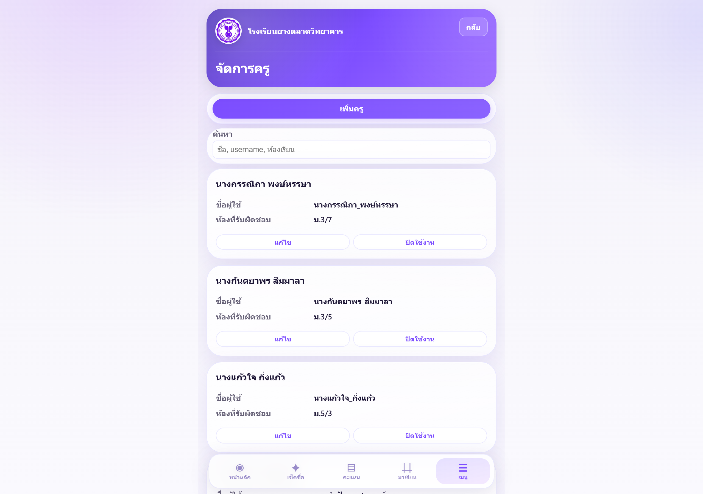
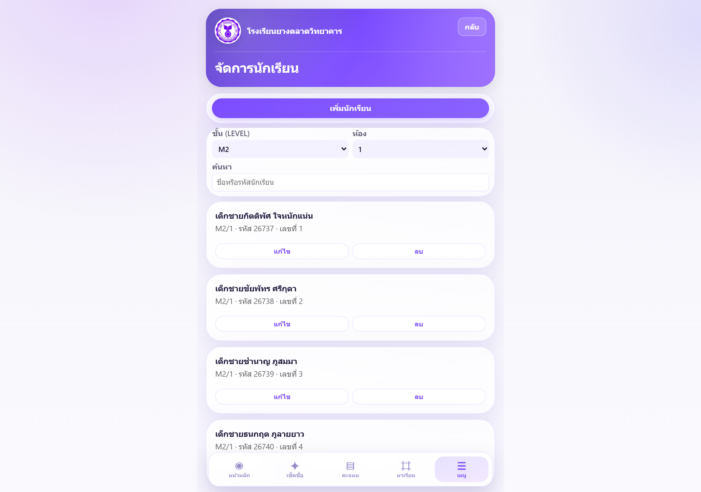
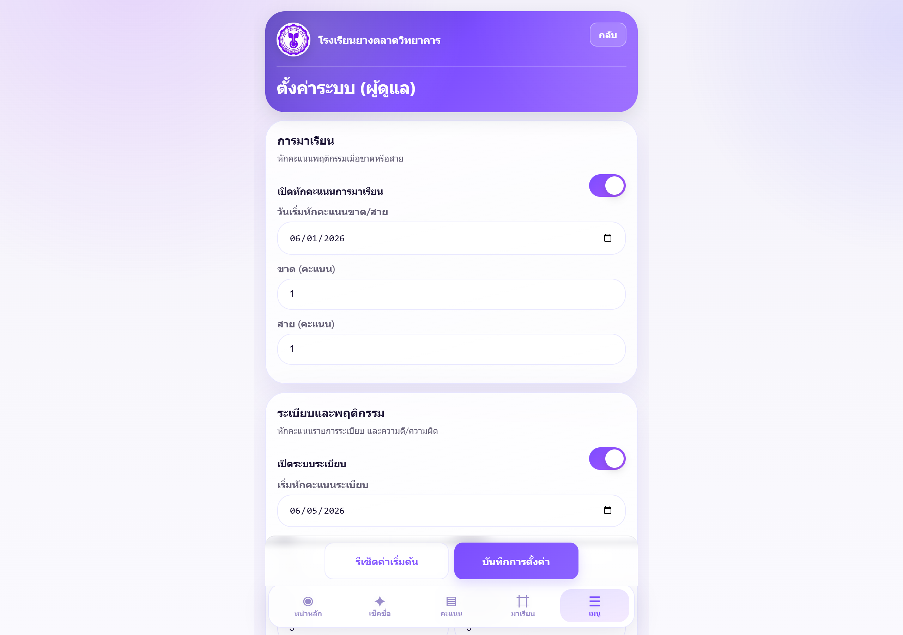
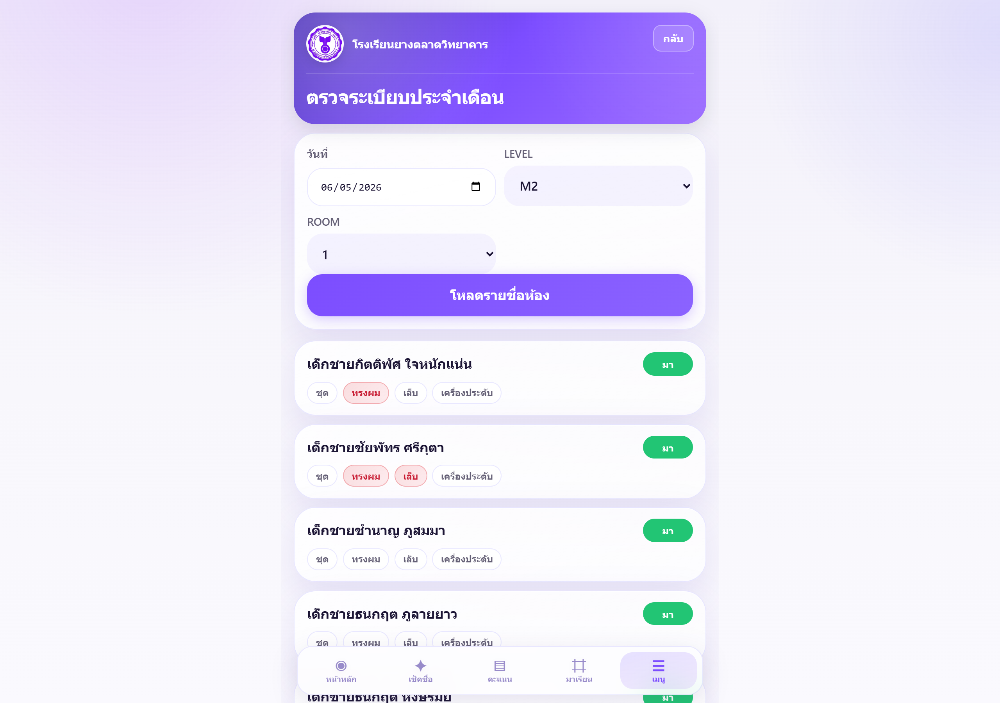

# คู่มือผู้ดูแลระบบ — Student Check

## 1. บทนำ

**เอกสารที่เกี่ยวข้อง:** คู่มือครู → **USER_MANUAL.pdf** · Quick Guide → **USER_QUICK_GUIDE.pdf**

### วัตถุประสงค์ของคู่มือ

คู่มือฉบับนี้จัดทำสำหรับ **ผู้ดูแลระบบ** และงานวิชาการ โรงเรียนยางตลาดวิทยาคาร เพื่อใช้เป็นคู่มือปฏิบัติงานบนแอป Student Check — ครอบคลุมการจัดการครูและนักเรียน การตรวจสอบและแก้ไขข้อมูลเช็คชื่อ การตั้งค่าระบบ รายงาน และการแก้ปัญหาเบื้องต้น โดยไม่จำเป็นต้องมีความรู้ด้านเทคนิคระบบ

**ที่อยู่เว็บไซต์:** https://student-check-th.web.app · **รหัสเอกสาร:** SC-AM-001 · **เวอร์ชัน:** 3.1.0

การเข้าสู่ระบบและภาพรวมเมนูจัดการ — ดู **☆ Quick Start** ในสารบัญ

## 2. บทบาทผู้ดูแลระบบ

### หน้าที่หลัก

| หน้าที่ | รายละเอียด |
|---------|------------|
| บริหารบัญชีครู | เพิ่ม · แก้ไข · ปิดใช้งาน · กำหนดห้องและสิทธิ์ |
| บริหารรายชื่อนักเรียน | เพิ่ม · แก้ไข · ลบ · ย้ายห้อง |
| ตรวจสอบข้อมูล | ดูและแก้ไขการเช็คชื่อย้อนหลัง · ตรวจระเบียบ |
| ตั้งค่าระบบ | คะแนน · วันตรวจระเบียบ · เกณฑ์แจ้งเตือน |
| รายงาน | สรุปการมาเรียนทั้งโรงเรียน · ส่งออก PDF |
| สนับสนุนครู | แจกคู่มือครู · ตอบปัญหาการใช้งานเบื้องต้น |

### สิทธิ์ที่ผู้ดูแลระบบมี

| กลุ่มงาน | รายการ |
|----------|--------|
| **ทุกห้องเรียน** | เช็คชื่อ · ดู/แก้ประวัติ · รายงาน · ตรวจระเบียบ |
| **จัดการครู** | เพิ่ม · แก้ไข · ปิด/เปิดใช้งาน · รีเซ็ต PIN (เมื่อเปิดระบบ PIN) |
| **จัดการนักเรียน** | เพิ่ม · แก้ไข · ลบ · ย้ายระดับชั้น (LEVEL) / ห้อง (ROOM) |
| **ตั้งค่าระบบ** | คะแนนมาเรียน/ระเบียบ · ตารางตรวจ · เกณฑ์เฝ้าระวัง |
| **คะแนนพฤติกรรม** | ดูรายงาน · คืนคะแนน · แก้/ลบรายการในโปรไฟล์นักเรียน |

บัญชีถือเป็นผู้ดูแลระบบเมื่อ **บทบาท = ผู้ดูแลระบบ** หรือ **ห้องที่รับผิดชอบ = ALL** (ตั้งได้ที่ **จัดการครู**)

### ข้อควรระวัง

:::warning
**⚠️ สำคัญ** — งานลบนักเรียน · ปิดใช้งานครู · แก้ประวัติทั้งห้อง มีผลต่อข้อมูลจริง · ตรวจสอบก่อนยืนยันทุกครั้ง
:::

- **อย่าแชร์** PIN ผู้ดูแลระบบหรือ PIN ชั่วคราวของครูในช่องทางสาธารณะ
- การ **ลบนักเรียน** ลบจากรายชื่อในระบบ — ข้อมูลเช็คชื่อเดิมยังคงอยู่ (อ้างอิงรหัสนักเรียน)
- การ **ปิดใช้งานครู** ไม่ใช่ลบถาวร — เปิดใช้งานได้อีกครั้ง
- ครูทั่วไปแก้ได้เฉพาะห้องที่รับผิดชอบ — ผู้ดูแลระบบแก้ได้ทุกห้อง

:::feature
| **วัตถุประสงค์** | เข้าใจขอบเขตสิทธิ์ก่อนปฏิบัติงาน |
| **ขั้นตอน** | ตรวจบทบาทของตนเองที่ **จัดการครู** → ทดสอบเข้า **จัดการระบบ** |
| **หมายเหตุ** | ถ้าไม่เห็นเมนู **จัดการ** แสดงว่ายังไม่มีสิทธิผู้ดูแลระบบ |
| **ข้อผิดพลาดที่พบบ่อย** | เข้าสู่ระบบด้วยบัญชีครูทั่วไป → ไม่เห็นเมนูจัดการ · แก้บทบาทที่ **จัดการครู** |
:::

## 3. การจัดการครู

**เมนู** ☰ → **จัดการ** → **จัดการครู**

### เพิ่มครู

:::feature
| **วัตถุประสงค์** | ลงทะเบียนครูใหม่ให้เข้าใช้งานได้ |
| **ขั้นตอน** | 1. กด **เพิ่มครู** · 2. กรอก ชื่อครู · ชื่อผู้ใช้ · ห้องที่รับผิดชอบ · บทบาท · 3. กรอก PIN ผู้ดูแลระบบ (ยืนยันตัวตน) · 4. **บันทึก** · 5. แจ้งชื่อผู้ใช้/PIN ให้ครูทางช่องทางที่ปลอดภัย |
| **หมายเหตุ** | หลายห้อง: `M1/3, M2/1` · ผู้ดูแลทั้งโรงเรียน: ห้อง = `ALL` · บทบาท = **ผู้ดูแลระบบ** |
| **ข้อผิดพลาดที่พบบ่อย** | รูปแบบห้องผิด (`M2-1` แทน `M2/1`) → ครูไม่เห็นห้อง · ชื่อผู้ใช้ซ้ำ → บันทึกไม่ได้ |
:::

:::figure-callout
**คำบรรยายภาพ:** ① ค้นหาครู · ② **แก้ไข** / **ปิดใช้งาน** · ③ **รีเซ็ต PIN** — แจ้ง PIN ชั่วคราวให้ครูเปลี่ยนเมื่อเข้าสู่ระบบครั้งถัดไป
:::

### แก้ไข · ปิดใช้งาน · กำหนดสิทธิ์

| งาน | ขั้นตอน |
|-----|--------|
| **แก้ไขข้อมูล** | ค้นหาชื่อครู → **แก้ไข** → ปรับชื่อ · ห้อง · บทบาท → **บันทึก** |
| **ปิดใช้งาน** | **ปิดใช้งาน** → ยืนยัน PIN → ครูเข้าระบบไม่ได้จนกว่าจะ **เปิดใช้งาน** อีกครั้ง |
| **รีเซ็ต PIN** | **รีเซ็ต PIN** (เมื่อเปิดระบบ PIN) → แจ้ง PIN ชั่วคราวให้ครู |

:::warning
**หมายเหตุ:** ระบบไม่มีปุ่มลบครูถาวร — ใช้ **ปิดใช้งาน** เมื่อครูลาออกหรือย้ายออก · รายละเอียดบทบาทและสิทธิ์ ดูบทที่ 2
:::

## 4. การจัดการนักเรียน

**เมนู** ☰ → **จัดการ** → **จัดการนักเรียน**

:::figure-callout
**คำบรรยายภาพ:** ① เลือกระดับชั้น (LEVEL) · ② เลือกห้อง (ROOM) · ③ **เพิ่มนักเรียน** · ④ **แก้ไข** / **ลบ** รายการ
:::
:::feature
| **วัตถุประสงค์** | ลงทะเบียนและดูแลรายชื่อนักเรียนในแต่ละห้อง |
| **ขั้นตอน — เพิ่ม** | 1. เลือก **LEVEL** และ **ROOM** · 2. กด **เพิ่มนักเรียน** · 3. กรอก รหัส · ชื่อ · เลขที่ · ข้อมูลผู้ปกครอง (ถ้ามี) · 4. ยืนยัน PIN ผู้ดูแลระบบ · 5. **บันทึก** |
| **ขั้นตอน — แก้ไข/ลบ/ย้าย** | **แก้ไข** → ปรับชื่อ · เลขที่ · ผู้ปกครอง · หรือเปลี่ยน LEVEL/ROOM · **ลบ** → ยืนยัน (รายชื่อหายจากห้อง แต่ข้อมูลเช็คชื่อเดิมยังอยู่) |
| **หมายเหตุ** | รหัสนักเรียนต้องไม่ซ้ำ · เลขที่ซ้ำในห้อง — ระบบขยับเลขที่คนอื่นอัตโนมัติ |
| **ข้อผิดพลาดที่พบบ่อย** | ไม่เลือกห้องก่อน → กดเพิ่มไม่ได้ · รหัสซ้ำ → ข้อมูลผิดพลาด |
:::

## 5. การจัดการห้องเรียน

ระบบ **ไม่มี** เมนู “สร้างห้องเรียน” แยก — ห้องเรียนเกิดจาก **ระดับชั้น (LEVEL) + ห้อง (ROOM)** ที่มีนักเรียนในระบบ

**ตัวอย่าง:** เพิ่มนักเรียนใน `M3/2` → กำหนดครูรับผิดชอบ `M3/2` ที่ **จัดการครู** → ครูเลือกห้องได้ที่ **เช็คชื่อ**

| งาน | วิธีทำในแอป |
|-----|-------------|
| **เปิดใช้ห้องใหม่** | **จัดการนักเรียน** → เพิ่มนักเรียนใน LEVEL/ROOM ใหม่ |
| **เปลี่ยนโครงสร้างห้อง** | ย้ายนักเรียนไป LEVEL/ROOM ที่ต้องการ |
| **เลิกใช้ห้อง** | ย้ายนักเรียนออก · ถอนห้องออกจาก **ห้องที่รับผิดชอบ** ของครู |
| **มอบหมายครูประจำชั้น** | **จัดการครู** → ใส่ห้อง เช่น `M2/1` หรือหลายห้อง `M2/1, M2/2` |

:::feature
| **วัตถุประสงค์** | จัดโครงสร้างห้องเรียนให้ครูเห็นห้องถูกต้อง |
| **ขั้นตอน** | 1. เพิ่มรายชื่อนักเรียนในห้อง · 2. กำหนดห้องให้ครูที่ **จัดการครู** · 3. ให้ครูทดสอบเลือกห้องที่ **เช็คชื่อ** |
| **หมายเหตุ** | รูปแบบห้องมาตรฐาน: `M1/1`, `M2/3` (ใช้ `/` ไม่ใช่ `-`) |
| **ข้อผิดพลาดที่พบบ่อย** | ครูไม่เห็นห้อง → ตรวจ **ห้องที่รับผิดชอบ** · ห้องว่างในรายการ → ยังไม่มีนักเรียนในห้องนั้น |
:::

## 6. รายงานและการตรวจสอบข้อมูล

### ตรวจสอบการเช็คชื่อ

**หน้าหลัก** สรุปวันนี้ทั้งโรงเรียน · **เช็คชื่อ** เลือกได้ทุกห้อง · **ประวัติ** ผ่าน **เมนู** ☰ → **ประวัติ** (หรือ **จัดการ** → **แก้ไข/ลบรายการเช็คชื่อ**)

:::feature
| **วัตถุประสงค์** | ตรวจและแก้ข้อมูลเช็คชื่อที่ผิดพลาด |
| **ขั้นตอน** | 1. ตั้ง **วันที่** · **ระดับชั้น/ห้อง** · (กรอง **ครู** ได้) · 2. แก้สถานะหรือ **ลบ** รายการ · 3. **บันทึก** |
| **หมายเหตุ** | ใช้ **ลบ** เมื่อเช็คผิดห้องทั้งหมด · ครูทั่วไปแก้ได้เฉพาะห้องตนเอง |
| **ข้อผิดพลาดที่พบบ่อย** | ไม่เห็นข้อมูล → ตรวจวันที่/ห้อง · ลืมบันทึกของครู → ยังไม่มีรายการในวันนั้น |
:::

:::figure-callout
**คำบรรยายภาพ:** ① วันที่ · ② ห้อง · ③ กรองครู · ④ แก้สถานะ / ลบ
:::

### ตั้งค่าระบบ

**เมนู** ☰ → **จัดการ** → **ตั้งค่าระบบ** — กำหนดคะแนนมาเรียน · ระเบียบ · ตารางตรวจ · เกณฑ์แจ้งเตือน ก่อนเปิดภาคเรียน

:::figure-callout
**คำบรรยายภาพ:** ① การมาเรียน · ② ระเบียบ · ③ ตารางตรวจ · ④ **บันทึก**
:::

### ตรวจระเบียบ

**เมนู** ☰ → **จัดการ** → **ตรวจระเบียบประจำเดือน** — เลือกวันตรวจ · ระดับชั้น/ห้อง · **โหลดรายชื่อ** · ติ๊กระเบียบ · **บันทึก** (ใช้ได้เฉพาะวันตรวจที่ตั้งใน **ตั้งค่าระบบ**)

:::figure-callout
**คำบรรยายภาพ:** ① วันตรวจ · ② ระดับชั้น/ห้อง · ③ **โหลดรายชื่อ** · ④ ติ๊กระเบียบ · ⑤ **บันทึก**
:::

### รายงานการมาเรียน

เมื่อข้อมูลเช็คชื่อถูกต้องแล้ว ใช้รายงานสรุปผลงานวิชาการดังนี้ — **แถบล่าง** → **มาเรียน**
:::feature
| **วัตถุประสงค์** | สรุปการมาเรียนและส่งออก PDF สำหรับงานวิชาการ |
| **ขั้นตอน** | 1. **มาเรียน** · 2. เลือกโหมด (รายวัน / รายเดือน / ภาคเรียน) · 3. ตั้งตัวกรอง · 4. **ส่งออก PDF** |
| **หมายเหตุ** | รายงานรายเดือน — **เลือก LEVEL และ ROOM ก่อน** ส่งออก PDF · ช่วงยาวเกิน 35 วัน (ไม่เลือกห้อง) — จำกัด |
| **ข้อผิดพลาดที่พบบ่อย** | PDF ว่าง → ไม่มีการเช็คชื่อในช่วงนั้น · เปิด PDF ไม่ได้ → ใช้ Edge หรือ Adobe Reader |
:::

:::figure-callout
**คำบรรยายภาพ:** ① แท็บโหมดรายงาน · ② ตัวกรองวันที่/ห้อง/ครู · ③ **ส่งออก PDF**
:::

| โหมด | ใช้เมื่อ |
|------|--------|
| **รายวัน** | ติดตามการเช็คชื่อวันนั้น · สรุปทั้งโรงเรียน (ไม่เลือกห้อง) |
| **รายเดือน** | ตารางรายเดือนรายห้อง — ส่ง ปพ. / สรุปประจำเดือน |
| **ภาคเรียน** | ภาพรวมภาคเรียน (ช่วงวันที่ตามระบบ) |

### ขั้นตอนประจำภาคเรียน

| ช่วง | งานหลัก |
|------|---------|
| **ก่อนเปิดภาคเรียน** | ตรวจรายชื่อ · บัญชีครู · **ตั้งค่าระบบ** · ทดสอบเช็คชื่อ · แจกคู่มือครู || **ระหว่างภาคเรียน** | ติดตามหน้าหลัก · แก้ข้อมูลที่ **ประวัติ** · ตรวจระเบียบ · ส่งออกรายงานรายเดือน |
| **สิ้นภาคเรียน** | ส่งออกรายงานภาคเรียน · อัปเดตรายชื่อ · ปิดใช้งานครูที่ลาออก |

:::warning
**หมายเหตุ:** ช่วงวันที่รายงาน **ภาคเรียน** คำนวณอัตโนมัติในระบบ — หากไม่ตรงปฏิทินโรงเรียน ให้ใช้รายงาน **รายเดือน** หรือ **รายวัน** กำหนดช่วงแทน
:::

## 7. ปัญหาที่พบบ่อย (FAQ)

| คำถาม | คำตอบ |
|-------|--------|
| ครูเข้าใช้งานไม่ได้ | **จัดการครู** → ตรวจ เปิดใช้งาน · ชื่อผู้ใช้ · ห้องที่รับผิดชอบ · รีเซ็ต PIN |
| ครูไม่เห็นห้อง | ตรวจรูปแบบ `M2/1` ที่ **จัดการครู** · ต้องมีนักเรียนในห้อง |
| ข้อมูลไม่แสดง | รีเฟรชแอป · ตรวจระดับชั้น/ห้อง · รายชื่ออาจโหลดช้าครั้งแรก |
| เช็คชื่อผิดวัน | **ประวัติ** → เลือกวันที่/ห้อง → แก้หรือลบ |
| ทุกคน “ขาด” | ครูต้องกด **มาทุกคน** ก่อน (ดู **USER_MANUAL.pdf**) |
| นักเรียนซ้ำ | **จัดการนักเรียน** → ตรวจรหัสไม่ซ้ำ · ลบรายการซ้ำ |
| รายงาน/PDF ว่าง | ตรวจว่ามีการเช็คชื่อในช่วงนั้น · รายเดือนต้องเลือกห้อง |
| ตรวจระเบียบโหลดไม่ได้ | **ตั้งค่าระบบ** → วันตรวจ · เปิดระบบระเบียบ |
| ไม่เห็นเมนูจัดการ | บัญชียังไม่ใช่ผู้ดูแลระบบ → แก้บทบาทที่ **จัดการครู** |
| เข้าเว็บไม่ได้ / ระบบล่ม | ตรวจอินเทอร์เน็ต · ติดต่อ **ผู้ให้บริการระบบ** (งาน IT โรงเรียน) |

## 8. Checklist ผู้ดูแลระบบ

| ช่วง | ✓ | รายการ |
|------|---|--------|
| **ต้นเทอม** | ☐ | รายชื่อนักเรียนครบทุกห้อง (**จัดการนักเรียน**) |
| | ☐ | บัญชีครูครบ · ห้องถูกต้อง (**จัดการครู**) |
| | ☐ | ตั้งค่าคะแนน · วันตรวจ · เกณฑ์แจ้งเตือน (**ตั้งค่าระบบ**) |
| | ☐ | ทดสอบเข้าสู่ระบบ · เช็คชื่อ · บันทึก · ดู **ประวัติ** |
| | ☐ | แจกคู่มือครู (USER_MANUAL · Quick Guide) |
| **รายเดือน** | ☐ | ตรวจห้องที่ยังไม่เช็คชื่อ (หน้าหลัก) |
| | ☐ | ตรวจระเบียบตามตาราง (**ตรวจระเบียบ**) |
| | ☐ | ส่งออกรายงานรายเดือน (**มาเรียน** → PDF) |
| | ☐ | ตอบคำถามครู (FAQ บท 7) |
| **สิ้นภาคเรียน** | ☐ | ส่งออกรายงานภาคเรียน/สรุปผล |
| | ☐ | อัปเดตรายชื่อ · ย้ายห้อง · ปิดใช้งานครูที่ลาออก |
| | ☐ | เตรียม Checklist ต้นเทอมถัดไป |

ครู → **USER_MANUAL.pdf** · ผู้ดูแลระบบ → คู่มือฉบับนี้ · ระบบขัดข้องรุนแรง → ติดต่อผู้ให้บริการระบบ (งาน IT โรงเรียน)