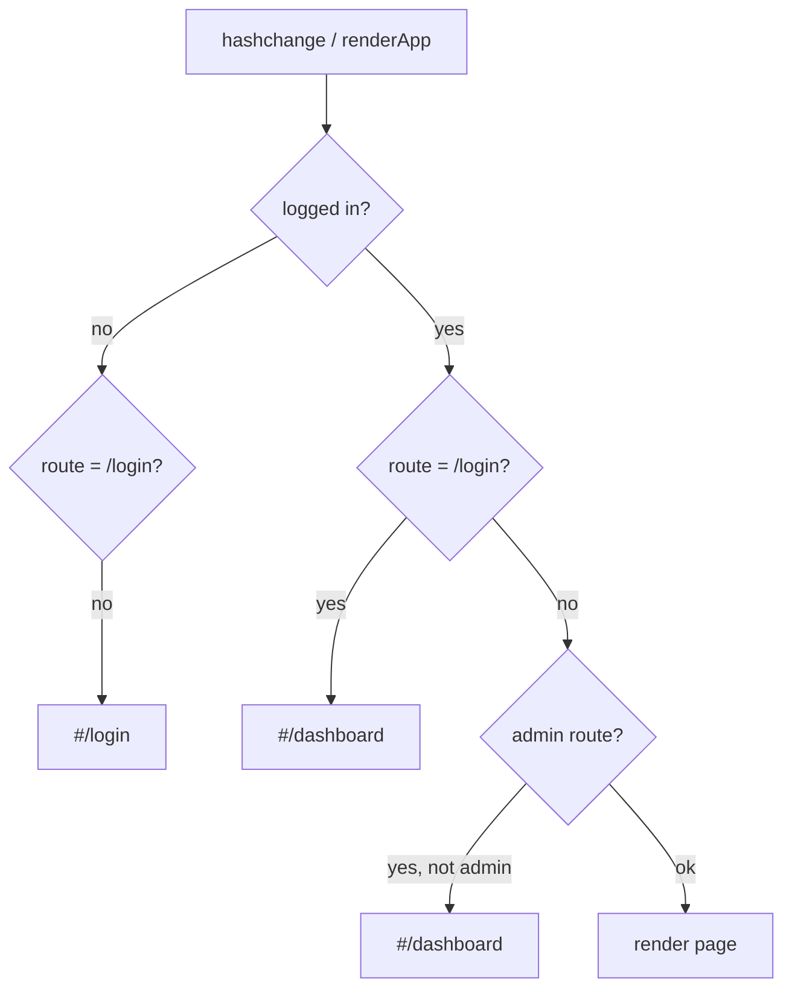
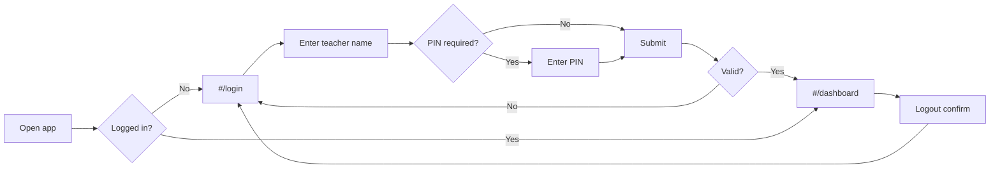
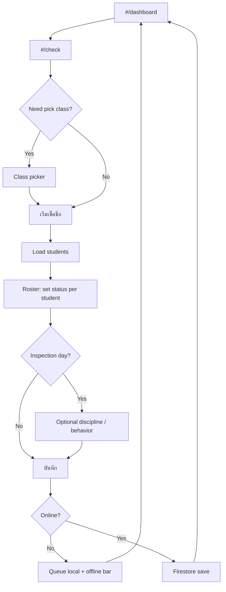
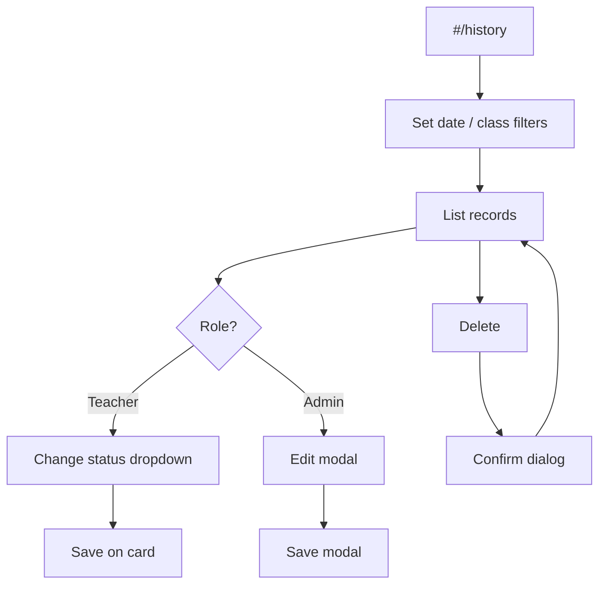
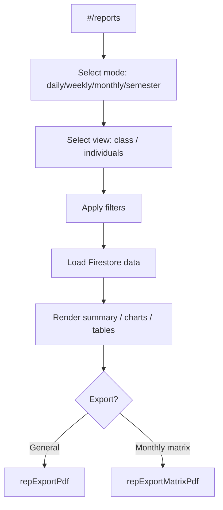
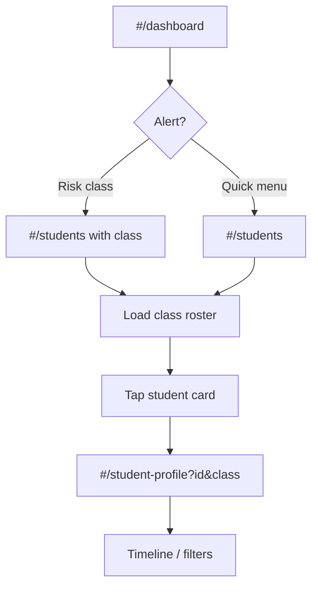
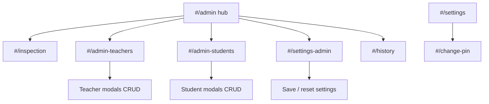
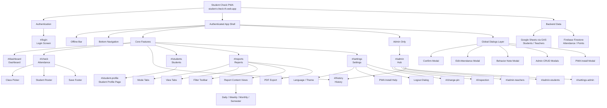

# Student Check — Application Sitemap

**Project:** ระบบเช็คชื่อนักเรียน · โรงเรียนยางตลาดวิทยาคาร  
**Version:** 3.0.1  
**Router:** Hash-based (`window.location.hash`) via `src/services/navigation.js` + `src/main.js`  
**Shell:** `#app` → `.page-shell` → offline bar + `.page-content` + bottom nav (logged-in only)

---

## 1. Route Map (All Routes)

| Hash route | Page module | Screen title (TH) | Auth | Role guard |
|------------|-------------|-------------------|------|------------|
| `#/` or empty | redirect | — | — | → `#/login` or `#/dashboard` |
| `#/login` | `login.js` | เข้าสู่ระบบ | Public | — |
| `#/dashboard` | `dashboard.js` | หน้าหลัก | Required | — |
| `#/check` | `check.js` | เช็คชื่อ | Required | Class access |
| `#/history` | `history.js` | ประวัติเช็คชื่อ | Required | Assigned classes |
| `#/students` | `students.js` | นักเรียน | Required | Assigned classes |
| `#/reports` | `reports.js` | รายงาน | Required | Assigned classes |
| `#/settings` | `settings.js` | ตั้งค่า | Required | — |
| `#/student-profile?id=&class=` | `studentProfile.js` | โปรไฟล์นักเรียน | Required | Query params |
| `#/admin` | `admin.js` | จัดการระบบ | Required | Admin only |
| `#/admin-teachers` | `adminTeachers.js` | จัดการครู | Required | Admin only |
| `#/admin-students` | `adminStudents.js` | จัดการนักเรียน | Required | Admin only |
| `#/inspection` | `inspection.js` | ตรวจระเบียบประจำเดือน | Required | Admin only |
| `#/settings-admin` | `settingsAdmin.js` | ตั้งค่าระบบ (ผู้ดูแล) | Required | Admin only |
| `#/change-pin` | `changePin.js` | เปลี่ยน PIN | Required | Admin only |
| *(unknown path)* | inline in `main.js` | ไม่พบหน้า | Any | `ui-empty` |

### Route guards (redirects)

**Admin-only routes:** `/admin`, `/inspection`, `/settings-admin`, `/admin-teachers`, `/admin-students`  
**Admin-only (non-admin redirect):** `/change-pin`

---

## 2. Global Shell (All Logged-In Screens)

| Layer | Component | Notes |
|-------|-----------|--------|
| Root | `#app` | Single mount point |
| Shell | `.page-shell` | Flex column, full viewport |
| Top | `#offlineBar` | `offlineBar.js` — offline / pending sync / syncing |
| Main | `main.page-content` | Route-specific content; CSS modifiers: `--login`, `--dashboard`, `--admin-*`, `has-fixed-save` |
| Brand | `.app-brand-strip` | Inserted `afterbegin`; **hidden** on non-login pages (`branding.css`) |
| Bottom | `.bottom-nav-wrap` | `navbar.js` — 5 tabs (teacher) or 6 tabs (admin) |
| Overlay | `.toast-message` | Global feedback (`main.js` `showToast`) |

### Bottom navigation targets

| Tab | Route | Visible |
|-----|-------|---------|
| หน้าหลัก | `/dashboard` | All |
| เช็คชื่อ | `/check` | All |
| ประวัติ | `/history` | All |
| รายงาน | `/reports` | All |
| จัดการ | `/admin` | Admin only |
| ตั้งค่า | `/settings` | All |

**Not in bottom nav:** `/students` (quick links from Dashboard, Check, Student Profile)

---

## 3. Screen Inventory (By Route)

### 3.1 `#/login` — Login

| Screen ID | Description |
|-----------|-------------|
| `login.main` | Full-screen login: brand hero, welcome form, footer credit |
| `login.pin-visible` | Same + PIN field shown (admin / PIN-enabled login) |
| `login.loading` | Submit disabled + status “กำลังตรวจสอบ…” |
| `login.error` | Inline status message on failed login |

---

### 3.2 `#/dashboard` — Dashboard

| Screen ID | Description |
|-----------|-------------|
| `dash.main` | Header, stats grid, quick actions, optional alerts & class chips |
| `dash.stats-loading` | `#dashboardStats` shows spinner |
| `dash.stats-loaded` | Present / late / absent / sick / errand / activity / % |
| `dash.alerts-ok` | “ไม่มีนักเรียนที่ต้องเฝ้าระวัง” |
| `dash.alerts-risk` | Per-class at-risk lists + “ดูรายชื่อห้องนี้” |
| `dash.alerts-inspection` | Banner: วันนี้เป็นวันตรวจระเบียบ |
| `dash.classes-empty` | Classes section hidden |
| `dash.classes-chips` | Today’s checked classes with counts |

---

### 3.3 `#/check` — Attendance

| Screen ID | Description |
|-----------|-------------|
| `check.picker` | Class picker sheet (LEVEL+ROOM / assigned class / fixed homeroom) |
| `check.picker-empty` | “เลือกชั้นเรียน” before start |
| `check.loading` | Loading students |
| `check.roster` | Summary row, search, student cards, discipline (inspection day) |
| `check.gas-error` | GAS not configured + link action |
| `check.footer-save` | Fixed footer “บันทึก” (visible when roster loaded) |

**Post-save flow:** toast → navigate `#/dashboard`

---

### 3.4 `#/history` — History

| Screen ID | Description |
|-----------|-------------|
| `hist.filters` | Date, level, room, teacher (admin), search |
| `hist.loading` | Loading list |
| `hist.empty` | No records |
| `hist.list-teacher` | Cards with status `<select>` + Save + Delete |
| `hist.list-admin` | Cards with Edit (modal) + Delete |

---

### 3.5 `#/students` — Students

| Screen ID | Description |
|-----------|-------------|
| `students.picker` | LEVEL / ROOM selectors + load |
| `students.loading` | Loading roster |
| `students.empty` | No students / pick class |
| `students.list` | Student admin cards (risk badges, tap → profile) |
| `students.error` | Load failed |

---

### 3.6 `#/student-profile` — Student Profile (full page)

Query: `?id={studentId}&class={classKey}`

| Screen ID | Description |
|-----------|-------------|
| `profile.loading` | Loading points / attendance |
| `profile.main` | Hero score ring, stats, timeline filters, transaction list |
| `profile.empty-txn` | No transactions hint |
| `profile.not-found` | Missing student / params |
| `profile.admin-actions` | Restore points, edit/delete txn (admin only) |

---

### 3.7 `#/reports` — Reports

**Chrome (always on page):**

| UI block | Controls |
|----------|----------|
| Mode tabs | รายวัน · รายสัปดาห์ · รายเดือน · ภาคเรียน (admin only) |
| View tabs | ทั้งห้อง · รายบุคคล |
| Toolbar filters | Date / week anchor / month / to-date, LEVEL, ROOM, teacher (admin) |
| Monthly matrix btn | PDF matrix export (monthly mode only) |

**Content states** (`reportsRender.js` — injected into `#reportContent`):

| Screen ID | Mode | View | Content |
|-----------|------|------|---------|
| `rep.daily-class-all` | daily | class | Header stats + class grid (admin, no room filter) |
| `rep.daily-class-one` | daily | class | Header + roster for one class |
| `rep.daily-students` | daily | students | Header + individual list |
| `rep.weekly` | weekly | class | Period banner + stat grid + day chart + table |
| `rep.weekly-students` | weekly | students | Individual section |
| `rep.monthly` | monthly | class | Period banner + stats + week chart + table |
| `rep.monthly-students` | monthly | students | Individual section |
| `rep.semester` | semester | class | Admin + class selected: month trend + table |
| `rep.semester-pick` | semester | * | Prompt to pick LEVEL+ROOM |
| `rep.loading` | * | * | `ui-loading` |
| `rep.empty` | * | * | `ui-empty` |
| `rep.export-pdf` | * | * | Bottom “ส่งออก PDF” section appended after render |

---

### 3.8 `#/settings` — Settings

| Screen ID | Description |
|-----------|-------------|
| `settings.main` | Profile, language, theme, PWA install, logout |
| `settings.admin-links` | Change PIN + System settings links (admin only) |

---

### 3.9 `#/change-pin` — Change PIN (admin)

| Screen ID | Description |
|-----------|-------------|
| `changepin.form` | Current PIN, new PIN, confirm, submit |

---

### 3.10 `#/admin` — Admin hub

| Screen ID | Description |
|-----------|-------------|
| `admin.hub` | 5 hub buttons → sub-routes |
| `admin.denied` | Non-admin empty state |

---

### 3.11 `#/admin-teachers` — Manage teachers

| Screen ID | Description |
|-----------|-------------|
| `adm-teach.list` | Search + teacher cards |
| `adm-teach.loading` / `empty` | List states |

---

### 3.12 `#/admin-students` — Manage students

| Screen ID | Description |
|-----------|-------------|
| `adm-stud.filters` | Level, room, search |
| `adm-stud.list` | Student cards with edit/delete |

---

### 3.13 `#/inspection` — Monthly inspection (admin)

| Screen ID | Description |
|-----------|-------------|
| `insp.filters` | Date, level, room, “โหลดรายชื่อห้อง” |
| `insp.not-scheduled` | Not an inspection day |
| `insp.roster` | Students + discipline flags + save inspection |
| `insp.pick-class` | Initial empty hint |

---

### 3.14 `#/settings-admin` — System settings (admin)

| Screen ID | Description |
|-----------|-------------|
| `setadm.form` | Attendance deductions, discipline, inspection schedule, parent-warning threshold |
| `setadm.footer` | Sticky Save / Reset |
| `setadm.denied` | Non-admin |

---

## 4. Dialogs & Modals (Overlay Layer)

All use `.modal-backdrop` unless noted. Not separate routes.

| Dialog ID | Trigger location | Component / function | Purpose |
|-----------|------------------|----------------------|---------|
| `dlg.logout` | Header logout, Settings | `confirmModal.js` | Confirm ออกจากระบบ |
| `dlg.history-delete` | History card | `confirmModal.js` | Confirm delete attendance record |
| `dlg.history-edit` | History (admin) | `editAttendanceModal.js` | Edit date, teacher, status |
| `dlg.behavior-note` | Check — good/bad deed | `behaviorNoteModal.js` | Required note for behavior |
| `dlg.settings-reset` | Settings admin | `confirmModal.js` | Confirm reset form to defaults |
| `dlg.profile-delete-txn` | Student profile (admin) | `confirmModal.js` | Delete point transaction |
| `dlg.profile-restore` | Student profile (admin) | inline in `studentProfile.js` | Restore points form |
| `dlg.profile-edit-txn` | Student profile (admin) | inline in `studentProfile.js` | Edit point transaction |
| `dlg.admin-teacher-add` | Admin teachers | inline `openTeacherModal` | Create teacher (+ PIN field) |
| `dlg.admin-teacher-edit` | Admin teachers | inline `openTeacherModal` | Edit teacher |
| `dlg.admin-teacher-deactivate` | Admin teachers | inline `openDeactivateModal` | Deactivate / activate |
| `dlg.admin-student-add` | Admin students | inline `openStudentModal` | Create student |
| `dlg.admin-student-edit` | Admin students | inline `openStudentModal` | Edit student |
| `dlg.admin-student-delete` | Admin students | inline `openDeleteModal` | Delete student |
| `dlg.pwa-install-help` | Settings install | `installPrompt.js` | iOS / browser install steps |
| `dlg.student-profile-modal` | *(unused in routes)* | `studentProfileModal.js` | Legacy modal profile — **not wired**; app uses `#/student-profile` page |

### Browser-native prompts

| Prompt | Location |
|--------|----------|
| `beforeinstallprompt` | PWA install (`installPrompt.js`) — handled in-app, not a custom dialog |

---

## 5. User Flows

### 5.1 Authentication

---

### 5.2 Daily attendance (primary teacher flow)

---

### 5.3 Correct past attendance

---

### 5.4 Reports & PDF

---

### 5.5 Student follow-up

---

### 5.6 Admin operations

---

## 6. Hierarchy Diagram (Site Structure)

---

## 7. Cross-Reference: Files → Routes

| Route | Primary file | Render helper |
|-------|--------------|---------------|
| `/login` | `src/pages/login.js` | — |
| `/dashboard` | `src/pages/dashboard.js` | — |
| `/check` | `src/pages/check.js` | `studentCard.js` |
| `/history` | `src/pages/history.js` | — |
| `/students` | `src/pages/students.js` | — |
| `/reports` | `src/pages/reports.js` | `reportsRender.js` |
| `/student-profile` | `src/pages/studentProfile.js` | `studentProfileTimeline.js` |
| `/settings` | `src/pages/settings.js` | `installPrompt.js` |
| `/change-pin` | `src/pages/changePin.js` | — |
| `/admin` | `src/pages/admin.js` | — |
| `/admin-teachers` | `src/pages/adminTeachers.js` | `adminPinField.js` |
| `/admin-students` | `src/pages/adminStudents.js` | — |
| `/inspection` | `src/pages/inspection.js` | `studentCard.js` (discipline) |
| `/settings-admin` | `src/pages/settingsAdmin.js` | — |
| Router | `src/main.js` | `getRoute()`, `renderApp()` |
| Navigation | `src/services/navigation.js` | `navigateTo()`, `goBack()` |
| Nav UI | `src/components/navbar.js` | `renderBottomNav()` |
| Header | `src/components/pageHeader.js` | `renderPageHeader()`, quick links |

---

## 8. Quick Links Matrix (In-Page Navigation)

| From | Quick links / actions |
|------|------------------------|
| `/check` | → `/dashboard`, `/students`, `/history` |
| `/students` | → `/dashboard`, `/check` |
| `/student-profile` | → `/students`, `/check`, `/dashboard` |
| Dashboard quick actions | → `/check`, `/history`, `/reports`, `/students`, `/admin` (admin) |
| Dashboard risk alert | → `/students` (with class context) |
| Admin hub | → `/inspection`, `/admin-teachers`, `/admin-students`, `/settings-admin`, `/history` |
| Reports individual row | → `/student-profile?id&class` |

---

*Generated from codebase scan (`src/main.js`, `src/pages/*`, `src/components/*`). Update this file when adding routes or modals.*
