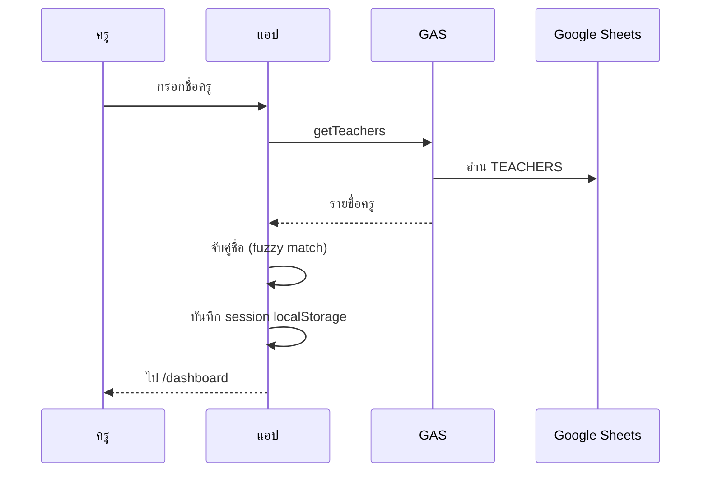
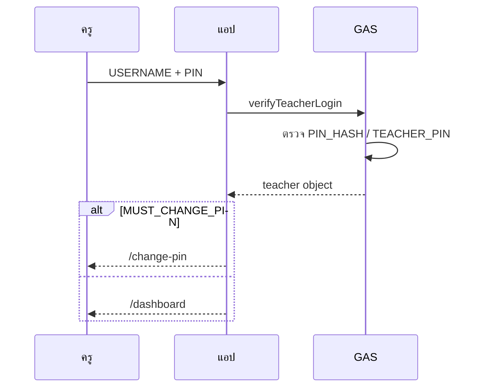
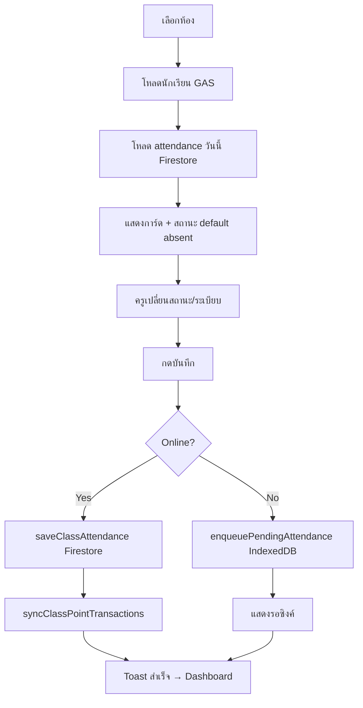

# เอกสารระบบทางเทคนิค — Student Check

**โรงเรียนยางตลาดวิทยาคาร**  
**เวอร์ชันแอป:** 2.0.0  
**Firebase Project ID:** `famous-augury-495905-c3`  
**Hosting URL:** https://student-check-th.web.app

---

# System Overview

Student Check เป็นระบบเช็คชื่อนักเรียนแบบ Progressive Web App (PWA) สำหรับครูและผู้ดูแลระบบโรงเรียน

## สถาปัตยกรรม

```
Browser (PWA)
    │
    ├─► Firebase Hosting          ไฟล์ static (dist/)
    │
    ├─► Firebase Firestore        attendance, student_points, app_settings
    │
    ├─► Firebase Analytics        (optional, เปิดใน firebaseClient.js)
    │
    ├─► Cloud Functions           issueTeacherToken (optional, asia-southeast1)
    │
    └─► Google Apps Script Web App
            │
            └─► Google Sheets
                    · Students
                    · TEACHERS
                    · Attendance (GAS-side, optional)
```

## โมดูลหลักของแอป

| โมดูล | ไฟล์หลัก | หน้าที่ |
|-------|----------|--------|
| Routing | `src/main.js` | Hash router, auth guard |
| Auth | `src/services/teachersService.js`, `teacherAuth.js` | Session, สิทธิ์ห้อง |
| Roster | `src/services/studentsService.js`, `googleAppsScript.js` | โหลดนักเรียนจาก GAS |
| Attendance | `src/services/attendanceService.js` | CRUD Firestore `attendance` |
| Points | `src/services/studentPointsService.js` | คะแนนพฤติกรรม |
| Settings | `src/services/appSettingsService.js` | Firestore `app_settings` |
| Offline | `src/services/offlineDb.js`, `offlineSync.js` | IndexedDB + sync queue |
| i18n | `src/i18n/translations.js` | ไทย / English |

## Feature Flag

| ตัวแปร | ค่า | ผล |
|--------|-----|-----|
| `VITE_ENABLE_PIN_LOGIN` | ไม่ตั้ง / ไม่ใช่ `'true'` | Login ด้วยชื่อครู (legacy) |
| `VITE_ENABLE_PIN_LOGIN` | `'true'` | Login ด้วย USERNAME + PIN ผ่าน GAS |

---

# Technology Stack

## Frontend

| รายการ | เทคโนโลยี |
|--------|-----------|
| Build tool | Vite 5.x |
| Language | JavaScript (ES modules) |
| Routing | Hash-based (`window.location.hash`) |
| PWA | vite-plugin-pwa, Workbox |
| PDF export | html2pdf.js, jsPDF |
| Offline storage | idb (IndexedDB) |
| Styling | CSS แยกไฟล์ (`src/styles/`) |

## Firebase

| บริการ | การใช้งาน |
|--------|-----------|
| **Firestore** | attendance, student_points, app_settings |
| **Hosting** | SPA จาก `dist/`, rewrite ทุก path → `index.html` |
| **Functions** | `issueTeacherToken` — ออก custom token หลัง verify GAS (optional) |
| **Analytics** | เปิดถ้า browser รองรับ |

Config ฝังใน `src/services/firebaseClient.js`:

- `projectId`: `famous-augury-495905-c3`
- `authDomain`: `famous-augury-495905-c3.firebaseapp.com`

## Google Apps Script

- ไฟล์อ้างอิง: `gas-sample/Code.gs`
- Deploy เป็น Web App (POST/GET JSON)
- Script properties: `SHEET_ID`, `gasSecret` (optional)
- PIN hash salt: `student-check-2026`

## Google Sheets

| แท็บ | ใช้โดย |
|------|--------|
| `Students` | รายชื่อนักเรียน |
| `TEACHERS` | รายชื่อครู + auth |
| `Attendance` | GAS API (parallel ไม่ใช่ primary ของแอป) |

---

# Database Structure

## Firestore

### Collection: `attendance`

**Document ID:** `{classKey with / → -}__{student_id}__{YYYY-MM-DD}`

**ตัวอย่าง ID:** `M2-1__6800123456789__2026-05-30`

| Field | Type | คำอธิบาย |
|-------|------|----------|
| `student_id` | string | รหัสนักเรียน |
| `student_name` | string | ชื่อ-นามสกุล |
| `class` | string | รูปแบบ `M2/1` |
| `status` | string | present, late, absent, sick, errand, activity |
| `teacherName` | string | ชื่อครูที่บันทึก |
| `attendanceDate` | string | YYYY-MM-DD |
| `disciplineFlags` | string[] | uniform, hair, nails, accessories |
| `disciplineBehaviors` | object[] | `{ kind: 'good'|'bad', note }` |
| `disciplineAdjust` | number | ปรับคะแนน manual (default 0) |
| `disciplineNote` | string | หมายเหตุ |
| `createdAt` | timestamp | serverTimestamp |

**ตัวอย่าง:**

```json
{
  "student_id": "6800123456789",
  "student_name": "เด็กชาย ตัวอย่าง เรียนดี",
  "class": "M2/1",
  "status": "present",
  "teacherName": "นางสาวเกศจุฬา ภูนาเมือง",
  "attendanceDate": "2026-05-30",
  "disciplineFlags": [],
  "disciplineBehaviors": [],
  "disciplineAdjust": 0,
  "disciplineNote": "",
  "createdAt": "2026-05-30T02:30:00.000Z"
}
```

### Collection: `student_points`

**Document ID (system):** `{student_id}__{date}__{category}__{reason}`  
**Document ID (manual):** `manual__{timestamp}__{random}`

| Field | Type | คำอธิบาย |
|-------|------|----------|
| `student_id` | string | |
| `student_name` | string | |
| `class` | string | |
| `category` | string | attendance \| discipline \| behavior \| manual |
| `reason` | string | absent, late, uniform, good, bad, restore, ... |
| `points` | number | บวกหรือลบ |
| `note` | string | |
| `transactionDate` | string | YYYY-MM-DD |
| `teacherName` | string | |
| `source` | string | system \| manual |
| `createdAt` | timestamp | |
| `editHistory` | array | ประวัติแก้ไข (admin) |

**ตัวอย่าง (ขาด):**

```json
{
  "student_id": "6800123456789",
  "student_name": "เด็กชาย ตัวอย่าง เรียนดี",
  "class": "M2/1",
  "category": "attendance",
  "reason": "absent",
  "points": -1,
  "transactionDate": "2026-05-30",
  "teacherName": "นางสาวเกศจุฬา ภูนาเมือง",
  "source": "system"
}
```

### Collection: `app_settings`

**Document ID:** `school`

| Section | Fields |
|---------|--------|
| `attendance` | enabled, absentDeduction, lateDeduction |
| `discipline` | enabled, startDate, uniformDeduction, hairDeduction, nailsDeduction, accessoryDeduction, goodBehaviorReward, badBehaviorDeduction |
| `inspection` | mode, inspectionDayType, dayOfMonth, dayOfWeek, customDates[] |
| `attendanceWarning` | thresholdPercent |
| `scoring` | startingScore |
| `updatedAt` | ISO string |

**Legacy:** document `inspection_schedule` (dates[]) — migrate ไป `inspection.customDates` อัตโนมัติ

**ค่าเริ่มต้น:** `src/config/appSettingsDefaults.js`

### Collections ใน `firestore.rules.secure` (ยังไม่ใช้ใน client)

- `students/{studentId}`
- `classes/{classKey}/students/{studentId}`
- `teachers/{teacherId}`
- `reports/{reportId}`

---

## Google Sheets

### แท็บ `Students`

| Column | Maps to |
|--------|---------|
| STUDENT_ID | student_id |
| PREFIX | prefix |
| FIRST_NAME | first_name |
| LAST_NAME | last_name |
| LEVEL | level |
| ROOM | room |
| NUMBER | number |
| CLASS_KEY | class_key |
| PARENT_NAME | parent_name |
| PARENT_PHONE | parent_phone |

### แท็บ `TEACHERS`

| Column | หมายเหตุ |
|--------|----------|
| TEACHER_NAME | Login (legacy mode) |
| USERNAME | Login (PIN mode) |
| ASSIGNED_CLASSES | M1/1, ALL |
| ROLE | teacher / admin |
| TEACHER_PIN | Plain PIN ชั่วคราว |
| PIN_HASH | SHA-256 |
| MUST_CHANGE_PIN | boolean |
| ACTIVE | boolean |

---

# Authentication Flow

## Legacy Mode (default — production ปัจจุบัน)



- Session key: `student-check-teacher-auth` (`TEACHER_AUTH_STORAGE_KEY`)
- Boot: `refreshTeacherSessionFromSheet()` ถ้า GAS configured — session หายถ้าไม่พบใน Sheet

## PIN Mode (`VITE_ENABLE_PIN_LOGIN=true`)



## Logout

1. ลบ `teacherAuth`, app state (`student-check-app-state`)
2. Hash → `/login`

## Authorization (หลัง login)

- `parseAssignedClasses()` → `['M2/1', ...]` หรือ `['ALL']`
- `canAccessLevelRoom(session, level, room)` — ตรวจก่อน save/check
- `isAdminSession()` — admin routes

---

# Attendance Flow



## รายละเอียด

1. **Doc ID** deterministic — upsert ทับรายการเดิมวันเดียวกัน
2. **Point sync** — สร้าง/อัปเดต/ลบ `student_points` ให้สอดคล้องกับ attendance + discipline
3. **Offline** — `cacheClassSession` เก็บ roster + attendance map
4. **Default status** — `CHECK_DEFAULT_STATUS = 'absent'`

---

# Scoring System

## สูตรคะแนนรวม

```
totalScore = startingScore + sum(positive points) - sum(|negative points|)
```

- `startingScore` default **100** (`app_settings.scoring.startingScore`)

## กติกาหัก/เพิ่ม (ค่าเริ่มต้น)

| เหตุการณ์ | category | reason | points |
|----------|----------|--------|--------|
| ขาด | attendance | absent | −1 |
| สาย | attendance | late | −1 |
| ชุด | discipline | uniform | −5 |
| ทรงผม | discipline | hair | −5 |
| เล็บ | discipline | nails | −5 |
| เครื่องประดับ | discipline | accessories | −5 |
| กระทำความดี | behavior | good | +5 |
| กระทำความผิด | behavior | bad | −5 |

## เงื่อนไขการสร้าง transaction

| ประเภท | เงื่อนไข |
|--------|----------|
| Attendance | `attendance.enabled === true` |
| Discipline | `canRecordDisciplineOnDate(date)` — เปิดระเบียบ + (หลัง startDate หรือวันตรวจ) |
| Inspection auto-fail | นักเรียนขาดในวันตรวจ → ติ๊กระเบียบครบทุกข้อ |

## เกณฑ์เสี่ยง / เชิญผู้ปกครอง

- `attendanceWarning.thresholdPercent` default **60%**
- สถานะเสี่ยง: absent, late, errand, sick, leave
- แสดงบน Dashboard, รายงาน, โปรไฟล์

## การคืนคะแนน (Admin)

Manual transaction ใน `student_points` — `category: manual`, `reason: restore`, คะแนนบวก

---

# API — Google Apps Script

## Actions (POST JSON `{ action, ... }`)

| action | คำอธิบาย |
|--------|----------|
| ping | ตรวจสอบ API |
| getStudents | รายชื่อตาม level/room |
| getClassOptions | levels + roomsByLevel |
| getTeachers | รายชื่อครู (ไม่ส่ง PIN) |
| verifyTeacherLogin | login + PIN |
| teacherRequiresPin | ตรวจว่าต้องใช้ PIN |
| changeTeacherCredentials | เปลี่ยน PIN/username |
| adminResetTeacherPin | admin รีเซ็ต PIN |
| getAttendance | อ่าน attendance sheet |
| saveAttendance | เขียน attendance sheet |

## Client config

- `VITE_GAS_WEB_APP_URL` หรือ `VITE_GOOGLE_SCRIPT_URL`
- Dev proxy: `/api/gas` → GAS URL (`vite.config.js`)

---

# Deployment Guide

## ข prerequisites

- Node.js + npm
- Firebase CLI (`npm i -g firebase-tools`)
- บัญชี Firebase project `famous-augury-495905-c3`
- Google Spreadsheet + Apps Script deployed

## ขั้นตอน

### 1. Clone / เปิดโปรเจกต์

```powershell
cd "student check"
npm install
```

### 2. ตั้งค่า `.env`

```env
VITE_GAS_WEB_APP_URL=https://script.google.com/macros/s/XXXX/exec
# VITE_ENABLE_PIN_LOGIN=true
```

### 3. พัฒนา local

```powershell
npm run dev
```

เปิด http://localhost:5173

### 4. Build

```powershell
npm run build
```

Output: `dist/`

### 5. Deploy Firebase

```powershell
firebase login
firebase use famous-augury-495905-c3
firebase deploy --only hosting:app
```

Deploy Firestore rules + indexes:

```powershell
firebase deploy --only firestore:rules,firestore:indexes
```

Deploy Cloud Functions (optional):

```powershell
cd functions
npm install
cd ..
firebase deploy --only functions
```

ตั้ง env functions: `GAS_WEB_APP_URL`, `GAS_SECRET`

### 6. Deploy GAS

1. Apps Script Editor → วาง `gas-sample/Code.gs`
2. Properties → `SHEET_ID`
3. Deploy → New deployment → Web app

### 7. ตรวจสอบหลัง deploy

- https://student-check-th.web.app/#/login
- Login ครูทดสอบ
- เช็คชื่อ → ตรวจ Firestore collection `attendance`
- รายงาน + PDF

---

# Maintenance Guide

## งานประจำ

| งาน | ความถี่ | วิธี |
|-----|---------|------|
| อัปเดตรายชื่อนักเรียน | ตามปีการศึกษา | แก้ Sheet Students |
| อัปเดตครู/ห้อง | เมื่อมีการย้ายห้อง | แก้ Sheet TEACHERS |
| ตรวจ Firestore usage | รายเดือน | Firebase Console |
| Backup Sheet | รายสัปดาห์ | Drive download / version history |
| Backup Firestore | ตามนโยบายโรงเรียน | Export / scheduled backup |

## การอัปเดตแอป

1. `git pull` / แก้โค้ด
2. ทดสอบ `npm run dev`
3. `git commit`
4. `npm run build`
5. `firebase deploy --only hosting:app`
6. แจ้งครูให้ refresh / ล้าง cache PWA ถ้าจำเป็น

## การเปิด PIN ใน production

1. เตรียม TEACHERS: USERNAME, PIN_HASH, MUST_CHANGE_PIN
2. Deploy GAS ล่าสุด
3. `.env`: `VITE_ENABLE_PIN_LOGIN=true`
4. build + deploy hosting
5. แจก credentials ครูทีละคน

## การ rollback

- **Hosting:** Firebase Console → Release history
- **Code:** `git checkout <tag>` → build → deploy
- **GAS:** Manage deployments → เลือก version เก่า

## Security checklist (production)

- [ ] เปลี่ยน `firestore.rules` เป็น `firestore.rules.secure` และ deploy
- [ ] เปิด Firebase Auth + Cloud Function `issueTeacherToken`
- [ ] ตั้ง `VITE_GAS_SECRET` / GAS secret
- [ ] เก็บ `.env` นอก Git
- [ ] ใช้ repo GitHub แบบ Private

## โครงสร้างไฟล์สำคัญ

```
student check/
├── src/
│   ├── main.js              Entry + routing
│   ├── pages/               UI แต่ละหน้า
│   ├── services/            Business logic
│   ├── config/              Defaults
│   └── i18n/                ภาษา
├── gas-sample/Code.gs       GAS backend
├── firebase.json            Firebase config
├── firestore.rules          Rules (dev)
├── firestore.indexes.json   Composite indexes
├── functions/               Cloud Functions
├── dist/                    Build output (gitignore)
└── .env                     Secrets (gitignore)
```

## Local storage keys

| Key | เนื้อหา |
|-----|---------|
| `student-check-teacher-auth` | Session ครู |
| `student-check-teacher-name` | ชื่อครู |
| `student-check-app-state` | UI state |
| `student_check_app_settings_v1` | Cache settings |
| `student-check-roster-*` | Cache นักเรียน (24h) |

---

# Appendix — Routes

| Hash | Page |
|------|------|
| `#/login` | Login |
| `#/dashboard` | Dashboard |
| `#/check` | เช็คชื่อ |
| `#/history` | ประวัติ |
| `#/reports` | รายงาน |
| `#/students` | นักเรียน |
| `#/student-profile?id=&class=` | โปรไฟล์ |
| `#/settings` | ตั้งค่า |
| `#/change-pin` | เปลี่ยน PIN |
| `#/admin` | จัดการ (admin) |
| `#/admin-teachers` | รีเซ็ต PIN (admin) |
| `#/inspection` | ตรวจระเบียบ (admin) |
| `#/settings-admin` | ตั้งค่าระบบ (admin) |

---

*เอกสารจัดทำจาก source code โปรเจกต Student Check — สำหรับส่งมอบงานและดูแลระบบ*
