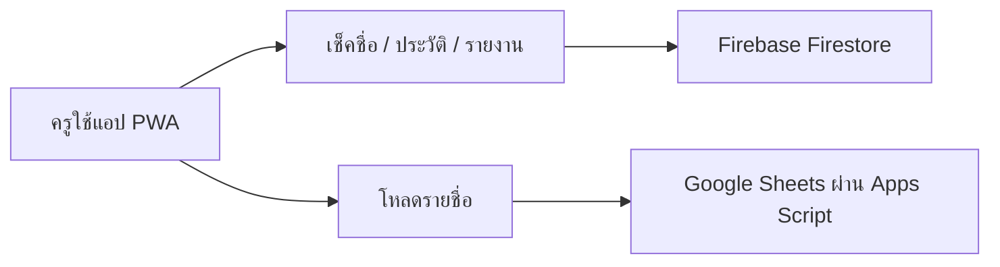
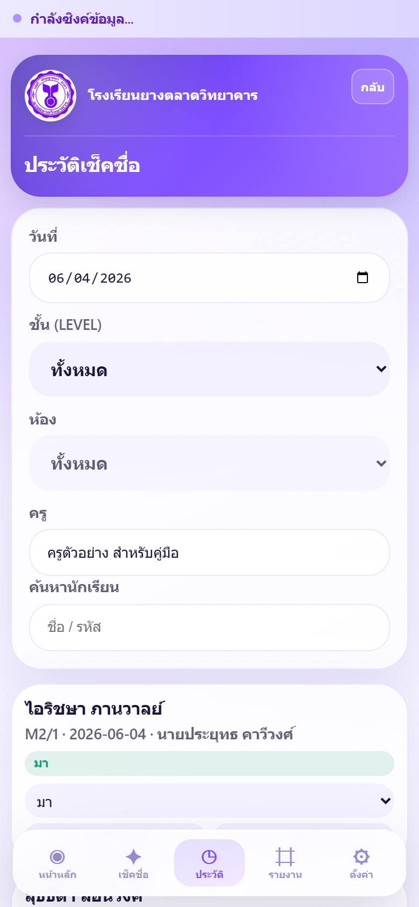
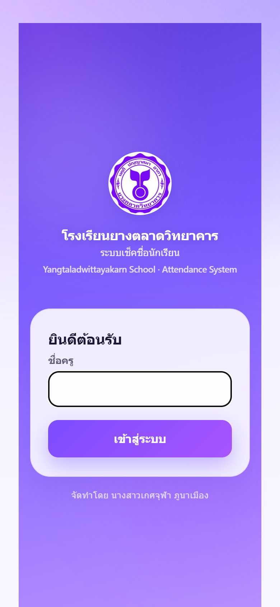
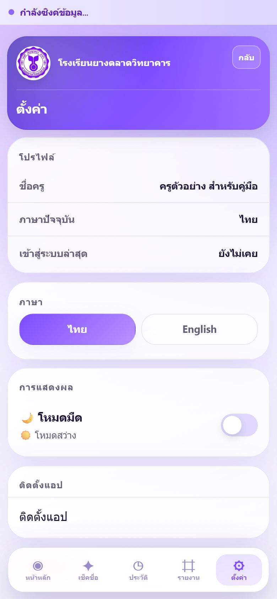
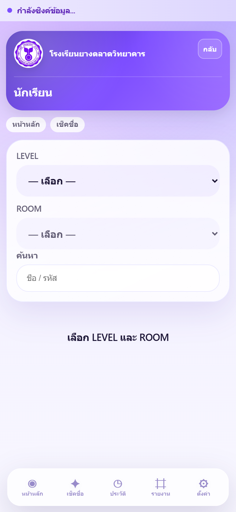

# คู่มือการใช้งานสำหรับครู  
## ระบบเช็คชื่อนักเรียน — โรงเรียนยางตลาดวิทยาคาร

| รายการ | รายละเอียด |
|--------|------------|
| **ชื่อระบบ** | Student Check (ระบบเช็คชื่อนักเรียน) |
| **เวอร์ชันแอป** | 3.0.1 |
| **URL ใช้งาน** | https://student-check-th.web.app |
| **กลุ่มผู้ใช้** | ครูผู้สอน · ครูประจำชั้น · ผู้ดูแลระบบ (ส่วนที่เกี่ยวข้องกับครู) |
| **อุปกรณ์ที่แนะนำ** | สมาร์ทโฟน / แท็บเล็ต (รองรับคอมพิวเตอร์) |
| **อัปเดตเอกสาร** | พฤษภาคม 2569 |

> คู่มือฉบับนี้อธิบายการใช้งานจากมุมมอง **ครู** เป็นหลัก งานจัดการระบบขั้นสูง (เพิ่มครู/นักเรียนใน Sheet, ตั้งค่าระบบ) อยู่ในคู่มือผู้ดูแลระบบแยก (`ADMIN_MANUAL.md`)

---

## สารบัญ

1. [บทนำ](#1-บทนำ)
2. [ภาพรวมระบบ](#2-ภาพรวมระบบ)
3. [คุณสมบัติหลัก](#3-คุณสมบัติหลัก)
4. [วิธีเข้าสู่ระบบ](#4-วิธีเข้าสู่ระบบ)
5. [วิธีเช็คชื่อนักเรียน](#5-วิธีเช็คชื่อนักเรียน)
6. [วิธีแก้ไขข้อมูล](#6-วิธีแก้ไขข้อมูล)
7. [วิธีดูรายงาน](#7-วิธีดูรายงาน)
8. [วิธีใช้งาน Dashboard](#8-วิธีใช้งาน-dashboard)
9. [คำถามที่พบบ่อย](#9-คำถามที่พบบ่อย)
10. [การแก้ไขปัญหาเบื้องต้น](#10-การแก้ไขปัญหาเบื้องต้น)

**ภาคผนวก:** [แถบเมนูล่าง](#ภาคผนวก-แถบเมนูล่าง) · [ติดตั้งแอบบนหน้าจอหลัก (PWA)](#ภาคผนวก-ติดตั้งแอบบนหน้าจอหลัก-pwa) · [หน้านักเรียนและโปรไฟล์](#ภาคผนวก-หน้านักเรียนและโปรไฟล์)

---

## 1. บทนำ

### วัตถุประสงค์

คู่มือนี้จัดทำขึ้นเพื่อให้ครูและบุคลากรของโรงเรียนยางตลาดวิทยาคาร สามารถใช้งาน **ระบบเช็คชื่อนักเรียน (Student Check)** ได้อย่างถูกต้อง รวดเร็ว และสอดคล้องกับกระบวนงานจริงในโรงเรียน โดยครอบคลุมตั้งแต่การเข้าสู่ระบบ การบันทึกการมาเรียน การแก้ไขข้อมูลย้อนหลัง การดูรายงาน และการใช้หน้าหลัก (Dashboard) เพื่อติดตามนักเรียนที่ต้องเฝ้าระวัง

### ขั้นตอนการใช้งาน

1. อ่าน [ภาพรวมระบบ](#2-ภาพรวมระบบ) และ [คุณสมบัติหลัก](#3-คุณสมบัติหลัก) เพื่อทำความเข้าใจขอบเขตของแอป
2. ติดตั้งแอปบนหน้าจอหลัก (แนะนำ) ตาม [ภาคผนวก PWA](#ภาคผนวก-ติดตั้งแอบบนหน้าจอหลัก-pwa)
3. ศึกษา [วิธีเข้าสู่ระบบ](#4-วิธีเข้าสู่ระบบ) แล้วลองเข้าใช้งานจริง
4. ใช้งานประจำวันตามลำดับ: **Dashboard → เช็คชื่อ → (ประวัติ/รายงาน ตามความจำเป็น)**

### ภาพประกอบ

> **📷 ภาพประกอบ:** หน้าจอต้อนรับ / โลโก้โรงเรียนบนหน้าเข้าสู่ระบบ  
> _(ใส่ภาพหน้าจอที่นี่ — ไฟล์อ้างอิง: `docs/screenshots/login.png`)_


### หมายเหตุ

- ระบบเป็น **Progressive Web App (PWA)** ใช้ผ่านเบราว์เซอร์ Chrome / Safari / Edge ได้ ไม่จำเป็นต้องติดตั้งจาก Store
- ข้อมูลรายชื่อนักเรียนและครูมาจาก **Google Sheets** ส่วนบันทึกการเช็คชื่อและคะแนนพฤติกรรมเก็บใน **Firebase**
- หากชื่อครูยังไม่อยู่ในระบบ หรือยังไม่ได้รับมอบหมายห้องเรียน ให้ประสาน **ผู้ดูแลระบบ** ก่อนใช้งาน

---

## 2. ภาพรวมระบบ

### วัตถุประสงค์

อธิบายสถาปัตยกรรมและการไหลของข้อมูลในระบบ เพื่อให้ครูเข้าใจว่าข้อมูลมาจากไหน บันทึกที่ไหน และส่วนใดที่แก้ไขได้ในแอป

### ขั้นตอนการใช้งาน

**โครงสร้างการทำงาน (ภาพรวม)**



1. ครูเปิดแอปที่ https://student-check-th.web.app
2. ระบบยืนยันตัวตนจากรายชื่อในแท็บ **TEACHERS** (Google Sheets)
3. รายชื่อนักเรียนโหลดจากแท็บ **STUDENTS** (Google Sheets)
4. การเช็คชื่อแต่ละวันบันทึกลง **Firestore** และนำไปสรุปในรายงาน / Dashboard
5. คะแนนพฤติกรรมคำนวณจากการมาเรียน ระเบียบ (วันตรวจ) และความดี/ความผิด (ตามนโยบายโรงเรียน)

**บทบาทครู vs ผู้ดูแลระบบ**

| รายการ | ครูทั่วไป | ผู้ดูแลระบบ |
|--------|-----------|-------------|
| ห้องเรียนที่เข้าถึงได้ | เฉพาะห้องใน `ASSIGNED_CLASSES` | ทุกห้อง (`ALL`) |
| รายงานภาคเรียน | ไม่แสดงแท็บ | แสดงแท็บภาคเรียน |
| เมนู **จัดการ** แถบล่าง | ไม่มี | มี |
| แก้ไขรายชื่อใน Sheet ผ่านแอป | ไม่ได้ | ได้ (เมนูจัดการ) |

### ภาพประกอบ

> **📷 ภาพประกอบ:** แผนภาพหรือภาพหน้าหลักหลังเข้าสู่ระบบ  
> _(ใส่ภาพหน้าจอที่นี่ — ไฟล์อ้างอิง: `docs/screenshots/dashboard.png`)_


### หมายเหตุ

- แอปออกแบบให้ใช้บน **มือถือเป็นหลัก** (ปุ่มใหญ่ แถบเมนูล่าง รองรับ safe area)
- รองรับ **ออฟไลน์ชั่วคราว**: บันทึกเช็คชื่อในคิวได้เมื่อไม่มีเน็ต (ต้องเคยโหลดรายชื่อห้องนั้นตอนออนไลน์มาก่อน)
- หลัง deploy เวอร์ชันใหม่ โดยทั่วไป **ปิดแอปแล้วเปิดใหม่** ก็ได้รับอัปเดต — ไม่จำเป็นต้องล้างแคชทุกครั้ง

---

## 3. คุณสมบัติหลัก

### วัตถุประสงค์

สรุปความสามารถที่ครูใช้งานได้จริงในแต่ละวัน เพื่อเลือกเมนูที่เหมาะกับงาน

### ขั้นตอนการใช้งาน

| คุณสมบัติ | เมนู / ทางเข้า | สิ่งที่ทำได้ |
|-----------|----------------|-------------|
| **เช็คชื่อรายวัน** | แถบล่าง → เช็คชื่อ | บันทึกสถานะ มา / สาย / ขาด / ลาป่วย / ลากิจ / ลากิจกรรม ทั้งห้อง |
| **มาทุกคน** | หน้าเช็คชื่อ | ตั้งสถานะทุกคนเป็น “มา” ในคลิกเดียว |
| **ระเบียบและพฤติกรรม** | การ์ดนักเรียน (วันตรวจระเบียบ) | บันทึกชุด ทรงผม เล็บ เครื่องประดับ · ความดี/ความผิด |
| **ประวัติย้อนหลัง** | แถบล่าง → ประวัติ | ค้นหา · แก้สถานะ · ลบรายการที่บันทึกแล้ว |
| **รายงาน** | แถบล่าง → รายงาน | รายวัน · รายสัปดาห์ · รายเดือน · ส่งออก PDF |
| **รายชื่อนักเรียน** | Dashboard → เมนูด่วน “นักเรียน” | ดูรายชื่อ · สรุปการมาเรียน · เปิดโปรไฟล์ |
| **Dashboard** | แถบล่าง → หน้าหลัก | สรุปวันนี้ · แจ้งเตือน · ห้องที่เช็คแล้ว |
| **ตั้งค่า** | แถบล่าง → ตั้งค่า | ภาษา · ธีม · ติดตั้งแอป · ออกจากระบบ |
| **ออฟไลน์** | แถบด้านบน (เมื่อไม่มีเน็ต) | บันทึกในคิว · ซิงค์เมื่อกลับมาออนไลน์ |

**สถานะการมาเรียนที่ใช้ในหน้าเช็คชื่อ**

| สถานะ | ความหมายโดยทั่วไป |
|-------|-------------------|
| มา | มาเรียนตรงเวลา |
| สาย | มาสาย |
| ขาด | ขาดเรียน |
| ลาป่วย | ลาด้วยเหตุป่วย |
| ลากิจ | ลากิจส่วนตัว |
| ลากิจกรรม | ลาเพื่อกิจกรรมของโรงเรียน |

### ภาพประกอบ

> **📷 ภาพประกอบ:** หน้าเช็คชื่อแสดงปุ่มสถานะและการ์ดนักเรียน  
> _(ใส่ภาพหน้าจอที่นี่ — ไฟล์อ้างอิง: `docs/screenshots/check.png`)_


### หมายเหตุ

- สถานะเริ่มต้นของนักเรียนที่ยังไม่ได้ตั้งค่าวันนี้คือ **ขาด** — ควรกด **มาทุกคน** หรือตั้งสถานะทีละคนก่อนบันทึก
- การหักคะแนนพฤติกรรมจากขาด/สาย/ระเบียบ ขึ้นกับ **การตั้งค่าระบบ** ที่ผู้ดูแลกำหนด (ครูใช้ตามที่ระบบคำนวณให้)
- ครู **ไม่แก้ไขรายชื่อนักเรียน** (ชื่อ รหัส ห้อง) ในแอป — แก้ที่ Google Sheets ผ่านผู้ดูแลระบบ

---

## 4. วิธีเข้าสู่ระบบ

### วัตถุประสงค์

ให้ครูเข้าใช้งานแอปได้ด้วยบัญชีที่ลงทะเบียนแล้ว และเข้าถึงเฉพาะห้องเรียนที่ได้รับมอบหมาย

### ขั้นตอนการใช้งาน

#### โหมดชื่อครู (ค่าเริ่มต้นของโรงเรียนส่วนใหญ่)

1. เปิดเบราว์เซอร์หรือแอปที่ติดตั้งไว้ ไปที่ **https://student-check-th.web.app**
2. ที่หน้า **ยินดีต้อนรับ** กรอก **ชื่อครู** ให้ตรงหรือใกล้เคียงกับชื่อใน Google Sheets (แท็บ TEACHERS)  
   - ใช้ชื่อจริงหรือชื่อที่ลงทะเบียน เช่น ชื่อเล่น ถ้าระบบจับคู่ได้  
   - หลีกเลี่ยงชื่อคลุมเครือหลายคน — ถ้าระบบแจ้ง “พบชื่อใกล้เคียงหลายคน” ให้กรอกชื่อเต็มให้ชัดขึ้น
3. กดปุ่ม **เข้าสู่ระบบ**
4. รอข้อความ “กำลังตรวจสอบข้อมูลครู...”
5. เมื่อสำเร็จ ระบบพาไป **หน้าหลัก (Dashboard)** โดยอัตโนมัติ

#### โหมด PIN (เมื่อโรงเรียนเปิดใช้งาน)

1. เปิด URL เดิม
2. กรอก **ชื่อผู้ใช้ (USERNAME)** และ **รหัส PIN** ตามที่ผู้ดูแลแจ้ง
3. กด **เข้าสู่ระบบ**
4. หากระบบบังคับเปลี่ยน PIN ครั้งแรก จะถูกพาไปหน้า **เปลี่ยน PIN** ก่อนใช้งานอื่น

#### การออกจากระบบ

1. ไป **ตั้งค่า** (แถบเมนูล่างขวา)
2. เลื่อนลง กด **ออกจากระบบ**
3. ยืนยันในกล่องข้อความ
4. กลับสู่หน้า Login

### ภาพประกอบ

> **📷 ภาพประกอบ:** ฟอร์มกรอกชื่อครูและปุ่มเข้าสู่ระบบ  
> _(ใส่ภาพหน้าจอที่นี่ — ไฟล์อ้างอิง: `docs/screenshots/login.png`)_


### หมายเหตุ

| ข้อความแจ้งเตือน | สาเหตุที่พบบ่อย | แนวทางแก้ |
|------------------|-----------------|-----------|
| กรุณาระบุชื่อครู | ยังไม่กรอกชื่อ | กรอกชื่อแล้วลองใหม่ |
| ไม่พบชื่อครูในระบบ | ชื่อไม่ตรง Sheet | ตรวจสอบแท็บ TEACHERS / ติดต่อผู้ดูแล |
| ครูท่านนี้ยังไม่ได้รับมอบหมายห้องเรียน | `ASSIGNED_CLASSES` ว่าง | ให้ผู้ดูแลระบบกำหนดห้อง |
| บัญชีถูกปิดการใช้งาน | `ACTIVE` = FALSE | ติดต่อผู้ดูแลระบบ |
| ยังไม่ได้ตั้งค่า Google Sheets | แอปยังไม่เชื่อม GAS | แจ้งผู้ดูแล / ฝ่ายเทคนิค |

- ปุ่ม **ออกจากระบบ** มีที่หัวข้อหลายหน้า (เช่น หน้าหลัก) นอกจากหน้าตั้งค่า
- ผู้ดูแลระบบอาจใช้ PIN เพิ่มเมื่อเข้าเมนูจัดการข้อมูลสำคัญ

---

## 5. วิธีเช็คชื่อนักเรียน

### วัตถุประสงค์

บันทึกสถานะการมาเรียนของนักเรียนทั้งห้องสำหรับ **วันปัจจุบัน** (ตามเวลาไทย) และส่งข้อมูลเข้าระบบกลางของโรงเรียน

### ขั้นตอนการใช้งาน

#### 5.1 เลือกห้องเรียน

1. จากแถบเมนูล่าง กด **เช็คชื่อ**
2. ระบบแสดงวันที่วันนี้และชื่อครูที่หัวข้อ
3. เลือกห้องตามประเภทบัญชีของคุณ:

| ประเภทครู | สิ่งที่เห็นบนหน้าจอ |
|-----------|---------------------|
| ครูประจำชั้น / มีห้องเดียว | ห้องถูกเลือกให้แล้ว — ข้ามไปรายชื่อได้เลย |
| ครูหลายห้อง | เลือกจากรายการ **ห้องเรียนที่รับผิดชอบ** |
| ผู้ดูแลระบบ | เลือก **LEVEL** แล้วเลือก **ROOM** |

4. กด **เริ่มเช็คชื่อ**
5. รอโหลดรายชื่อนักเรียน (แสดง “กำลังโหลดนักเรียน...”)

#### 5.2 ตั้งสถานะแต่ละคน

1. ใช้ช่อง **ค้นหา รหัส / ชื่อ** หากห้องมีนักเรียนจำนวนมาก
2. บนการ์ดแต่ละคน กดปุ่มสถานะ: **มา · สาย · ขาด · ลาป่วย · ลากิจ · ลากิจกรรม**
3. หรือกด **มาทุกคน** เพื่อตั้งทุกคนเป็น “มา” แล้วแก้เฉพาะคนที่มาสาย/ขาด/ลา
4. **วันตรวจระเบียบ** (ถ้ามีแบนเนอร์แจ้ง): แตะรายการระเบียบที่ฝ่าฝืน · บันทึกความดี/ความผิดพร้อมหมายเหตุ (ถ้ามี)

#### 5.3 บันทึก

1. ตรวจสอบสรุปตัวเลขด้านบน (มา / สาย / ขาด ฯลฯ) ให้ตรงความเป็นจริง
2. กดปุ่ม **บันทึก** ที่แถบล่างของหน้า (เหนือเมนูนำทาง)
3. เมื่อสำเร็จ จะเห็นข้อความ **บันทึกการเช็คชื่อเรียบร้อยแล้ว**
4. ระบบพากลับ **หน้าหลัก**

#### 5.4 เปลี่ยนห้อง (ครูหลายห้อง / ผู้ดูแล)

1. กด **เปลี่ยนห้อง**
2. เลือก LEVEL / ROOM หรือห้องที่รับผิดชอบใหม่
3. กด **เริ่มเช็คชื่อ** อีกครั้ง

### ภาพประกอบ

> **📷 ภาพประกอบ:** รายชื่อนักเรียนพร้อมปุ่มสถานะและปุ่มบันทึก  
> _(ใส่ภาพหน้าจอที่นี่ — ไฟล์อ้างอิง: `docs/screenshots/check.png`)_


### หมายเหตุ

- เช็คชื่อได้เฉพาะ **วันนี้** บนหน้านี้ — แก้ย้อนหลังใช้หน้า **ประวัติ**
- **ออฟไลน์:** แถบด้านบนแสดง “ออฟไลน์ — บันทึกในเครื่อง...” — บันทึกได้ แต่ต้องเคยโหลดรายชื่อห้องนั้นตอนมีเน็ต · กลับมาออนไลน์แล้วกด **ซิงค์เลย**
- อย่าปิดแอปทันทีหลังกดบันทึกจนกว่าจะเห็นข้อความสำเร็จ
- หากโหลดนักเรียนไม่สำเร็จ ตรวจสอบการเชื่อม Google Sheets (แจ้งผู้ดูแล)

---

## 6. วิธีแก้ไขข้อมูล

### วัตถุประสงค์

แก้ไขหรือลบรายการเช็คชื่อที่บันทึกผิด พลาดวัน หรือสถานะไม่ตรงความจริง โดยใช้หน้า **ประวัติ** เป็นหลัก

### ขั้นตอนการใช้งาน

#### 6.1 แก้ไขการเช็คชื่อย้อนหลัง (ครูทั่วไป)

1. กดแถบล่าง **ประวัติ**
2. ตั้ง **ตัวกรอง**:
   - **วันที่** — วันที่ต้องการแก้
   - **ชั้น (LEVEL)** และ **ห้อง** — เลือกห้องหรือ “ทั้งหมด” ในห้องที่มีสิทธิ์
   - **ค้นหานักเรียน** — พิมพ์ชื่อหรือรหัส (ถ้าต้องการ)
3. รอรายการโหลด — แต่ละการ์ดแสดงชื่อ · ห้อง · วันที่ · ครู · สถานะ
4. เปลี่ยนสถานะจาก **เมนูเลือก (dropdown)** บนการ์ด
5. กด **บันทึก** บนการ์ดนั้น
6. เมื่อสำเร็จ จะเห็นข้อความ **อัปเดตแล้ว**

#### 6.2 ลบรายการเช็คชื่อ

1. ในหน้า **ประวัติ** ค้นหารายการที่ต้องการลบ
2. กด **ลบ** บนการ์ด
3. ยืนยันในกล่องข้อความ
4. รายการจะถูกลบถาวรจากระบบ

#### 6.3 แก้ไขแบบละเอียด (ผู้ดูแลระบบ)

1. ในหน้า **ประวัติ** กด **แก้ไข** บนการ์ด
2. ในหน้าต่างแก้ไข ปรับ **วันที่ · ชื่อครู · สถานะ** ตามต้องการ
3. กด **บันทึก**

#### 6.4 สิ่งที่ครูแก้ไขในแอปไม่ได้

| ข้อมูล | แก้ที่ไหน |
|--------|----------|
| ชื่อนักเรียน · รหัส · ห้อง · ผู้ปกครอง | Google Sheets (แจ้งผู้ดูแล) |
| คะแนนพฤติกรรมรายการเดิม (คืนคะแนน/ลบรายการ) | โปรไฟล์นักเรียน — ส่วนใหญ่เฉพาะผู้ดูแล |

### ภาพประกอบ

> **📷 ภาพประกอบ:** หน้าประวัติพร้อมตัวกรองและการ์ดรายการ  
> _(ใส่ภาพหน้าจอที่นี่ — ไฟล์อ้างอิง: `docs/screenshots/history.png`)_



### หมายเหตุ

- ครูเห็นเฉพาะห้องใน **ASSIGNED_CLASSES** — ถ้าไม่เห็นห้องที่ต้องการ ติดต่อผู้ดูแล
- ช่อง **ครู** ในตัวกรอง: ครูทั่วไปเห็นเฉพาะชื่อตนเอง (อ่านอย่างเดียว) · ผู้ดูแลกรองตามครูได้
- การลบมีผลถาวร — ควรยืนยันวันที่และชื่อนักเรียนก่อนลบ
- หลังแก้ไข ตัวเลขใน **รายงาน** และ **Dashboard** จะอัปเดตเมื่อโหลดข้อมูลใหม่

---

## 7. วิธีดูรายงาน

### วัตถุประสงค์

สรุปและวิเคราะห์การมาเรียนในระดับห้องหรือรายบุคคล ตามช่วงเวลา เพื่อใช้ในการติดตาม รายงานผู้ปกครอง หรือประชุมระดับชั้น

### ขั้นตอนการใช้งาน

#### 7.1 เข้าหน้ารายงาน

1. กดแถบล่าง **รายงาน**
2. เลือก **โหมดรายงาน** (แท็บด้านบน):

| โหมด | ครูทั่วไป | ผู้ดูแลระบบ |
|------|-----------|-------------|
| รายวัน | ✓ (มุ่งวันในช่วงที่เลือกได้ตามสิทธิ์) | ✓ เลือกวันได้ |
| รายสัปดาห์ | ✓ | ✓ |
| รายเดือน | ✓ | ✓ |
| ภาคเรียน | — | ✓ |

3. เลือก **มุมมอง**:
   - **ทั้งห้อง** — สรุปเปอร์เซ็นต์ · กริดห้อง (แอดมินดูทุกห้อง) · รายชื่อห้องที่เลือก
   - **รายบุคคล** — รายชื่อนักเรียนพร้อม % และป้าย **เสี่ยง** (เมื่อเข้าเกณฑ์)

#### 7.2 ตั้งตัวกรอง

1. ในแถบ **ตัวกรอง** ตั้งค่าตามโหมด:
   - **รายวัน:** วันที่ (หรือวันนี้)
   - **รายสัปดาห์:** เลือกวันอ้างอิงในสัปดาห์ (ระบบรวม 7 วัน)
   - **รายเดือน:** เลือก **เดือน**
   - **ภาคเรียน:** ระบบคำนวณช่วงเทอมอัตโนมัติ (พ.ค.–ต.ค. / พ.ย.–เม.ย.)
2. เลือก **LEVEL** และ **ROOM** (จำเป็นสำหรับมุมมองรายบุคคล และรายงานภาคเรียนของแอดมิน)
3. (ผู้ดูแล) เลือก **ชื่อครู** เป็น “ทั้งหมด” หรือครูคนใดคนหนึ่ง
4. รอระบบโหลด — แสดงสรุปตัวเลข กราฟ (โหมดสัปดาห์/เดือน) และตาราง

#### 7.3 อ่านผลรายวัน (ตัวอย่าง)

1. ดูแถบสรุป: **เปอร์เซ็นต์มา · มา · สาย · ขาด · ลาป่วย · ลากิจ** (ขึ้นหลายแถวบนมือถือ ไม่ล้นจอ)
2. **ทั้งห้อง + ไม่เลือกห้องเจาะจง (แอดมิน):** เห็นกริดการ์ด M1/1, M1/2, ... พร้อม % และจำนวน
3. **เลือกห้องแล้ว:** เห็นรายชื่อนักเรียนวันนั้น · กลุ่ม **ต้องติดตาม** (ขาด/สาย)

#### 7.4 ส่งออก PDF

1. เลือกโหมด · ช่วงเวลา · ห้องให้ครบ
2. เลื่อนลงล่าง (หรือใช้ปุ่มในโหมดรายเดือน) กด **ส่งออก PDF**
3. ไฟล์จะดาวน์โหลด — รายงานรายเดือนมีตัวเลือก **ตาราง PDF รายเดือน** (เมื่อเลือกโหมดรายเดือน)

4. แตะ **การ์ดนักเรียน** ในมุมมองรายบุคคล เพื่อเปิด **โปรไฟล์** (ถ้าต้องการดูรายละเอียดคะแนน)

### ภาพประกอบ

> **📷 ภาพประกอบ:** หน้ารายงานพร้อมแท็บโหมด ตัวกรอง และสรุปรายห้อง  
> _(ใส่ภาพหน้าจอที่นี่ — ไฟล์อ้างอิง: `docs/screenshots/reports.png`)_



### หมายเหตุ

- ครูเห็นรายงานเฉพาะ **ห้องที่รับผิดชอบ** (ข้อความ “รายงานเฉพาะห้องเรียนที่คุณรับผิดชอบ”)
- PDF อาจจำกัดจำนวนรายการต่อไฟล์ — ถ้าข้อมูลมากให้จำกัดช่วงหรือห้อง
- ป้าย **เสี่ยง** ใช้เกณฑ์การมาเรียนสะสมในภาคเรียน (ขาด+สาย+ลาฯลฯ รวมเกิน % ที่โรงเรียนตั้ง) — ไม่ใช่แค่วันเดียว
- หากไม่มีข้อมูล ลองเปลี่ยนวันที่หรือตรวจว่ามีการเช็คชื่อในช่วงนั้นแล้ว

---

## 8. วิธีใช้งาน Dashboard

### วัตถุประสงค์

ใช้ **หน้าหลัก** เป็นจุดเริ่มต้นประจำวัน: ดูสรุปการเช็คชื่อวันนี้ แจ้งเตือนนักเรียนเสี่ยง และเข้าเมนูด่วน

### ขั้นตอนการใช้งาน

1. หลังเข้าสู่ระบบ ระบบเปิด **หน้าหลัก** โดยอัตโนมัติ (หรือกด **หน้าหลัก** ที่แถบล่าง)
2. อ่าน **ส่วนหัว**: คำทักทาย · ชื่อโรงเรียน · ชื่อครู · ปุ่ม **ออกจากระบบ** (ถ้าต้องการ)
3. ดู **สรุปวันนี้**:
   - จำนวน **มา · สาย · ขาด · ลาป่วย · ลากิจ · ลากิจกรรม**
   - **เปอร์เซ็นต์มาเรียน** (รวมจากห้องที่เกี่ยวข้องกับคุณวันนี้)
4. อ่าน **แจ้งเตือน** (ถ้ามี):
   - **วันนี้เป็นวันตรวจระเบียบ** — อย่าลืมบันทึกระเบียบในการ์ดนักเรียนตอนเช็คชื่อ
   - **นักเรียนต้องเฝ้าระวัง** — แยกตามห้อง · กด **ดูรายชื่อห้องนี้** เพื่อไปหน้านักเรียน
5. ดู **ห้องที่เช็ควันนี้**: ชิปแต่ละห้อง · จำนวนที่เช็คแล้ว · เปอร์เซ็นต์
6. ใช้ **เมนูด่วน**:

| ปุ่ม | ไปที่ |
|------|-------|
| เช็คชื่อ | บันทึกการมาเรียนวันนี้ |
| ประวัติ | แก้ไข / ลบย้อนหลัง |
| รายงาน | สรุปและ PDF |
| นักเรียน | รายชื่อและโปรไฟล์ |
| จัดการระบบ | เฉพาะผู้ดูแลระบบ |

7. (ถ้ามี) อ่าน **กิจกรรมล่าสุด** — รายการเช็คชื่อล่าสุดของคุณ

### ภาพประกอบ

> **📷 ภาพประกอบ:** หน้าหลักแสดงสรุปวันนี้ แจ้งเตือน และเมนูด่วน  
> _(ใส่ภาพหน้าจอที่นี่ — ไฟล์อ้างอิง: `docs/screenshots/dashboard.png`)_


### หมายเหตุ

- สรุปวันนี้ของครูทั่วไปแสดงเฉพาะรายการที่ **คุณเป็นผู้เช็ค** / ห้องที่เกี่ยวข้อง (ตามการตั้งค่าสิทธิ์)
- แจ้งเตือน “เฝ้าระวัง” คำนวณจาก **ภาคเรียน** — อาจมีนักเรียนในรายการแม้วันนี้มาครบ
- หากเห็น “ยังไม่ได้เช็คห้องใดวันนี้” ให้กดเมนูด่วน **เช็คชื่อ**
- โหลดสรุปไม่สำเร็จ: กดรีเฟรชหรือตรวจสอบอินเทอร์เน็ต

---

## 9. คำถามที่พบบ่อย

### วัตถุประสงค์

รวบรวมคำถามที่ครูมักถาม พร้อมคำตอบสั้นๆ

### ขั้นตอนการใช้งาน

อ่านหัวข้อที่ตรงกับปัญหาของคุณ:

**Q1: ลืมกดบันทึกหลังเช็คชื่อ ข้อมูลหายไหม?**  
- ถ้ายังไม่กด **บันทึก** ข้อมูลยังไม่เข้า Firestore — ต้องเช็คชื่อและบันทึกใหม่  
- ถ้าบันทึกแล้วแต่สถานะผิด → ใช้หน้า **ประวัติ** แก้ไข

**Q2: ทำไมนักเรียนทุกคนเริ่มต้นเป็น “ขาด”?**  
- เป็นค่าเริ่มต้นของระบบ — ใช้ **มาทุกคน** หรือตั้งสถานะก่อนบันทึก

**Q3: เช็คชื่อวันอื่น (ไม่ใช่วันนี้) ได้ไหม?**  
- หน้าเช็คชื่อ = วันนี้เท่านั้น · วันอื่นแก้ผ่าน **ประวัติ** (หรือให้ผู้ดูแลแก้แบบละเอียด)

**Q4: ทำไมไม่เห็นห้องของฉัน?**  
- ตรวจสอบ `ASSIGNED_CLASSES` ใน Sheet · ติดต่อผู้ดูแลระบบ

**Q5: รายงานไม่ตรงกับที่เช็คไป**  
- ตรวจวันที่/ห้องในตัวกรอง · รอโหลดใหม่ · ตรวจว่าบันทึกสำเร็จหรือค้างออฟไลน์

**Q6: ป้าย “เสี่ยง” / “ติดตาม” หมายความว่าอย่างไร?**  
- สัดส่วนการขาด/สาย/ลารวมในภาคเรียนเกินเกณฑ์ที่โรงเรียนตั้ง — ควรติดตามและอาจเชิญผู้ปกครอง

**Q7: ต้องล้างแคช PWA ทุกครั้งที่อัปเดตแอปไหม?**  
- **ไม่จำเป็น** — ปิดแอปแล้วเปิดใหม่ หรือรีเฟรชหน้า มักได้เวอร์ชันล่าสุด · ล้างแคชเฉพาะเมื่อหน้าจอยังเก่าผิดปกติ

**Q8: ใช้มือถือกับคอมพิวเตอร์ต่างกันได้ไหม?**  
- ได้ — Login ชื่อเดียวกัน · ข้อมูลรวมบน Cloud

**Q9: เปลี่ยนภาษา / ธีมได้ที่ไหน?**  
- **ตั้งค่า** → เลือกไทย/English · สลับโหมดมืด

**Q10: ครูแก้รายชื่อนักเรียนในแอปได้ไหม?**  
- **ไม่ได้** — แจ้งผู้ดูแลแก้ใน Google Sheets

### ภาพประกอบ

> **📷 ภาพประกอบ:** หน้าตั้งค่าแสดงภาษา ธีม และเวอร์ชันแอป  
> _(ใส่ภาพหน้าจอที่นี่ — ไฟล์อ้างอิง: `docs/screenshots/settings.png`)_



### หมายเหตุ

- คำถามเกี่ยวกับ **เพิ่มครู · PIN · ตั้งค่าระเบียบ · ตารางตรวจ** ดูใน `ADMIN_MANUAL.md`
- หากมีข้อสงสัยด้านเทคนิค (เน็ต · Sheet · Firebase) แจ้งผู้ดูแลระบบหรือฝ่าย IT ของโรงเรียน

---

## 10. การแก้ไขปัญหาเบื้องต้น

### วัตถุประสงค์

ให้ครูแก้ปัญหาการใช้งานเบื้องต้นได้เองก่อนแจ้งผู้ดูแลระบบ ลดเวลารอและไม่กระทบการเช็คชื่อในเวลาเรียน

### ขั้นตอนการใช้งาน

#### 10.1 แอปเปิดไม่ขึ้น / หน้าว่าง

1. ตรวจสอบ **อินเทอร์เน็ต** (Wi‑Fi / ข้อมูลมือถือ)
2. ลอง URL: https://student-check-th.web.app
3. ปิดแท็บแล้วเปิดใหม่ หรือปิดแอป (สไลด์ปิด) แล้วเปิดใหม่
4. ลองเบราว์เซอร์อื่น (Chrome แนะนำ)

#### 10.2 เข้าสู่ระบบไม่ได้

1. ตรวจชื่อครูใน Sheet / ลองชื่อเต็ม
2. ตรวจว่าบัญชี **ACTIVE** และมี **ห้องที่มอบหมาย**
3. แจ้งผู้ดูแลหากข้อความ “ยังไม่ได้ตั้งค่า Google Sheets”

#### 10.3 โหลดนักเรียนไม่ได้

1. ตรวจเน็ต
2. รอ 10–20 วินาที แล้วกด **ลองใหม่** (ถ้ามี)
3. เปลี่ยนห้องแล้วกลับมาห้องเดิม
4. แจ้งผู้ดูแลตรวจ Sheet และการเชื่อม Apps Script

#### 10.4 บันทึกไม่สำเร็จ / ค้างออฟไลน์

1. ดูแถบด้านบน: **ออฟไลน์** หรือ **รออัปโหลด N รายการ**
2. เมื่อมีเน็ต กด **ซิงค์เลย**
3. อย่าเช็คชื่อออฟไลน์ห้องที่ไม่เคยโหลดรายชื่อมาก่อน

#### 10.5 หน้ารายงานล้นจอ / กดไม่เห็นปุ่มล่าง

1. เลื่อนลงให้สุด — มี padding สำหรับแถบเมนูล่าง
2. หมุนจอแนวตั้ง (แนะนำ)
3. อัปเดตแอป: ปิดแล้วเปิดใหม่ (เวอร์ชัน 3.0.1 ขึ้นไปปรับเลย์เอาต์มือถือแล้ว)

#### 10.6 หน้าจอยังเป็นเวอร์ชันเก่า

1. ปิดแอบสมบูรณ์ → เปิดใหม่
2. รีเฟรชหน้า (ดึงลงเพื่อรีเฟรช)
3. ถ้ายังไม่เปลี่ยน: ล้างแคชเบราว์เซอร์ **เฉพาะไซต์** student-check-th.web.app แล้วเข้าใหม่

#### 10.7 ตารางสรุปไม่ตรง / PDF ว่าง

1. ตรวจตัวกรองวันที่ · ห้อง · โหมดรายงาน
2. ยืนยันว่ามีการเช็คชื่อในช่วงนั้น
3. ลดช่วงหรือเลือกห้องเดียวแล้วส่งออก PDF อีกครั้ง

### ภาพประกอบ

> **📷 ภาพประกอบ:** แถบแจ้งออฟไลน์ / รอซิงค์ (ถ้ามี)  
> _(ใส่ภาพหน้าจอที่นี่ — แนะนำถ่ายจากมือถือจริงเมื่อไม่มีเน็ต)_


### หมายเหตุ

- บันทึก **วันที่ · เวลา · ข้อความแจ้งเตือน · ห้องที่ใช้** เมื่อแจ้งผู้ดูแล — ช่วยแก้เร็วขึ้น
- ปัญหา Sheet / Firebase / สิทธิ์ครู ต้องให้ **ผู้ดูแลระบบ** เป็นผู้แก้
- ฉุกเฉินระหว่างเช็คชื่อ: บันทึกลงสมุดหรือ Excel ชั่วคราว แล้วค่อยลงระบบเมื่อเน็ตพร้อม (ระวังซ้ำ — ตรวจประวัติก่อนบันทึกซ้ำ)

---

## ภาคผนวก: แถบเมนูล่าง

### วัตถุประสงค์

อธิบายการนำทางหลักของแอป

### ขั้นตอนการใช้งาน

| ไอคอน | ชื่อ | หน้าที่ |
|-------|------|--------|
| ◉ | หน้าหลัก | Dashboard |
| ✦ | เช็คชื่อ | บันทึกการมาเรียนวันนี้ |
| ◷ | ประวัติ | ดู / แก้ / ลบย้อนหลัง |
| ⌗ | รายงาน | สรุปและ PDF |
| ⚡ | จัดการ | **เฉพาะผู้ดูแลระบบ** |
| ⚙ | ตั้งค่า | โปรไฟล์ · ภาษา · ธีม · ออกจากระบบ |

**หน้านักเรียน** ไม่มีในแถบล่าง — เข้าจาก **เมนูด่วนบนหน้าหลัก**

### ภาพประกอบ

> **📷 ภาพประกอบ:** แถบเมนูล่างครบ 5–6 ปุ่ม  
> _(ใส่ภาพหน้าจอที่นี่)_

### หมายเหตุ

- บนมือถือจอแคบ เมนู **จัดการ** (6 ปุ่ม) อาจแสดงเฉพาะไอคอน

---

## ภาคผนวก: ติดตั้งแอบบนหน้าจอหลัก (PWA)

### วัตถุประสงค์

ให้เปิดแอปได้เร็วเหมือนแอปมือถือทั่วไป โดยไม่ต้องพิมพ์ URL ทุกครั้ง

### ขั้นตอนการใช้งาน

1. เปิดแอปในเบราว์เซอร์แล้ว Login
2. ไป **ตั้งค่า**
3. ในส่วน **ติดตั้งแอป** กด **ติดตั้งแอป** (Android/Chrome บางรุ่น)  
   หรือกด **วิธีติดตั้งแอป** แล้วทำตามขั้นตอนบนหน้าจอ
4. **iPhone/iPad (Safari):** แชร์ → **Add to Home Screen** / **เพิ่มที่หน้าจอโฮม**
5. เปิดจากไอคอนบนหน้าจอหลัก

### ภาพประกอบ

> **📷 ภาพประกอบ:** หน้าตั้งค่าส่วนติดตั้งแอป  
> _(ใส่ภาพหน้าจอที่นี่ — ไฟล์อ้างอิง: `docs/screenshots/settings.png`)_

### หมายเหตุ

- ข้อความ “มีเวอร์ชันใหม่ — รีเฟรชหน้าเว็บ” แปลว่ามีอัปเดต — รีเฟรชหรือปิดเปิดแอป

---

## ภาคผนวก: หน้านักเรียนและโปรไฟล์

### วัตถุประสงค์

ดูรายชื่อ ข้อมูลผู้ปกครอง สรุปการมาเรียน และคะแนนพฤติกรรมรายคน

### ขั้นตอนการใช้งาน

1. จาก **หน้าหลัก** กดเมนูด่วน **นักเรียน** (หรือจากแจ้งเตือน “ดูรายชื่อห้องนี้”)
2. เลือก **LEVEL** และ **ROOM**
3. ค้นหาชื่อหรือรหัส (ถ้าต้องการ)
4. แตะการ์ดนักเรียน → เปิด **โปรไฟล์**
5. ในโปรไฟล์ ดู:
   - คะแนนพฤติกรรมปัจจุบัน · % คงเหลือ
   - สถิติการมาเรียน · % ลา
   - **ประวัติรายการ** (เช็คชื่อ · ระเบียบ · ความดี/ผิด)
6. กรองประวัติด้วยแท็บ **ทั้งหมด / เช็คชื่อ / ระเบียบ / ความดี-ผิด**

### ภาพประกอบ

> **📷 ภาพประกอบ:** รายชื่อนักเรียนและป้ายติดตาม  
> _(ใส่ภาพหน้าจอที่นี่ — ไฟล์อ้างอิง: `docs/screenshots/students.png`)_



### หมายเหตุ

- รายชื่อเรียง **นักเรียนที่ต้องติดตามก่อน** (ถ้ามีข้อมูลสรุป)
- ครูดูได้อย่างเดียว — **แก้คะแนน/ลบรายการ** เป็นสิทธิ์ผู้ดูแลในโปรไฟล์

---

## การสร้าง PDF จากคู่มือนี้

จากโฟลเดอร์โปรเจกต์ (ต้องมี Node.js):

```bash
npm run docs:pdf
```

หรือสร้าง PDF โดยไม่ถ่ายภาพใหม่:

```bash
npm run docs:pdf:fast
```

---

*เอกสารนี้จัดทำจากระบบ Student Check v3.0.1 — โรงเรียนยางตลาดวิทยาคาร · หากมีข้อเสนอแนะเพิ่มเติมในเนื้อหา แจ้งผู้ดูแลระบบหรือทีมพัฒนา*
