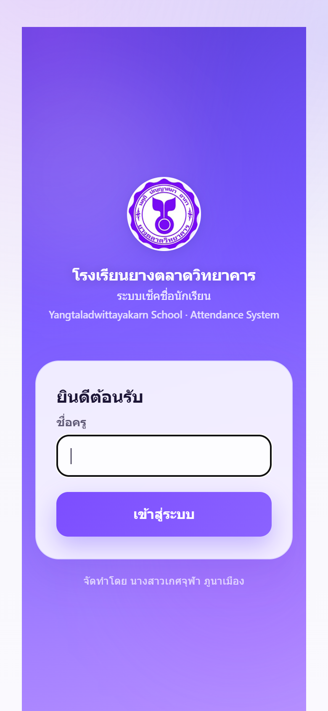
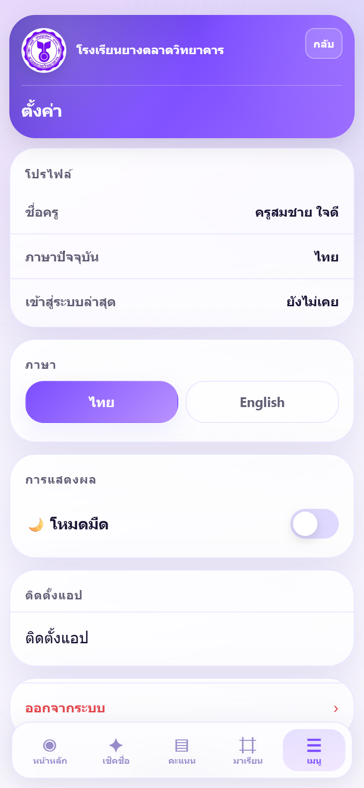
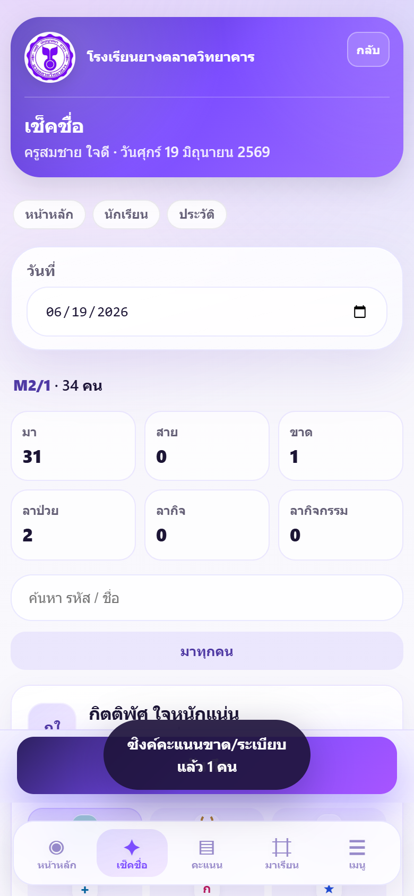
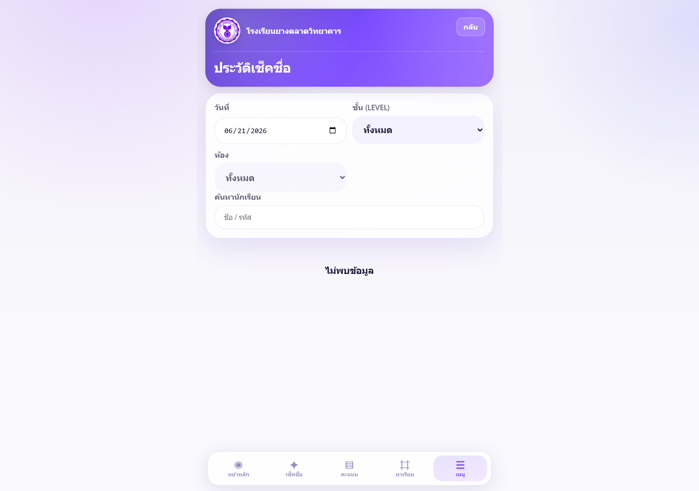
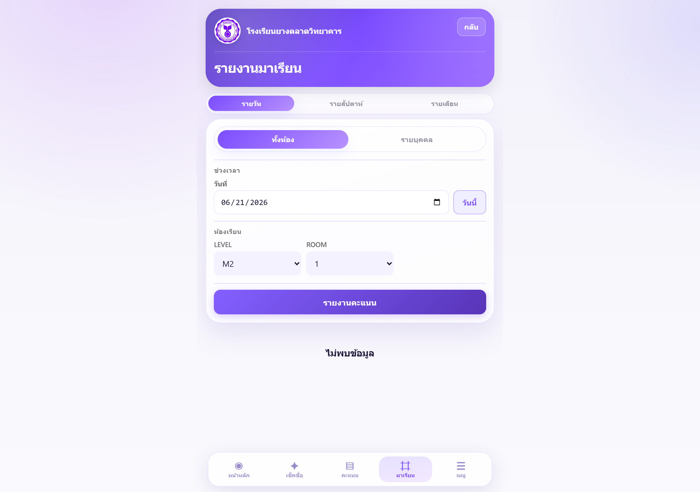
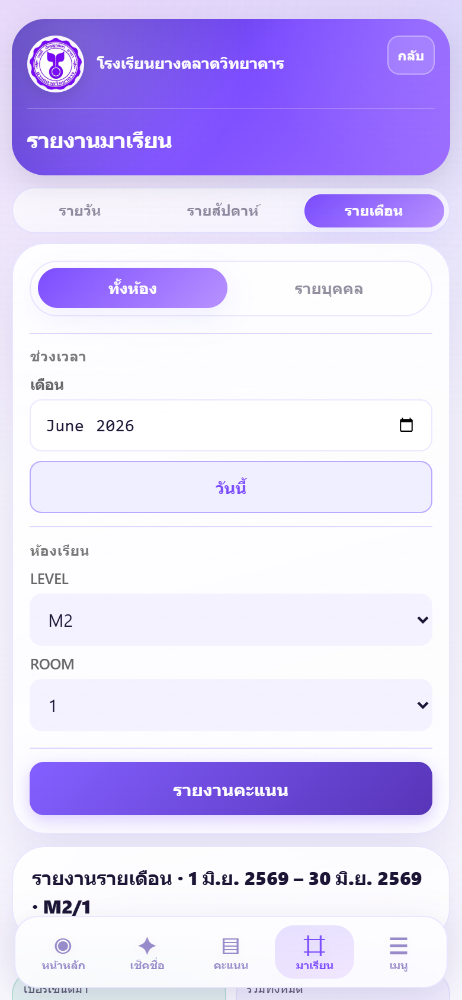
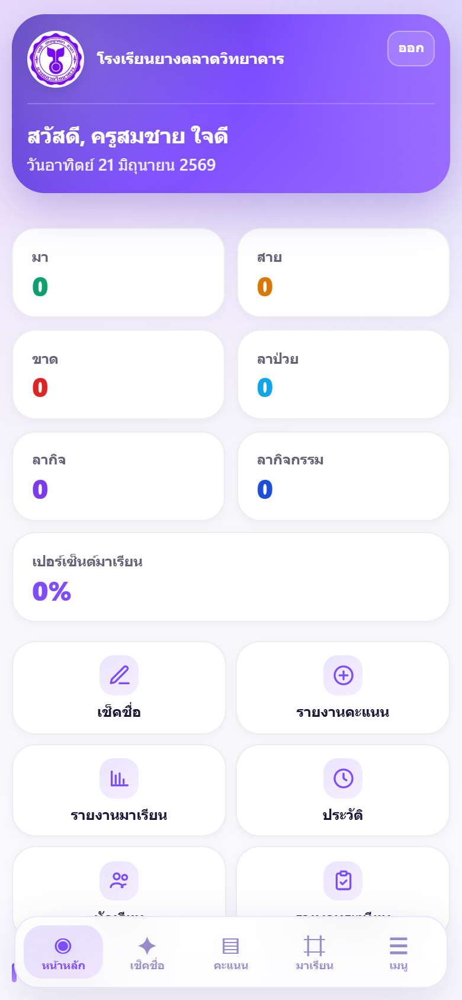
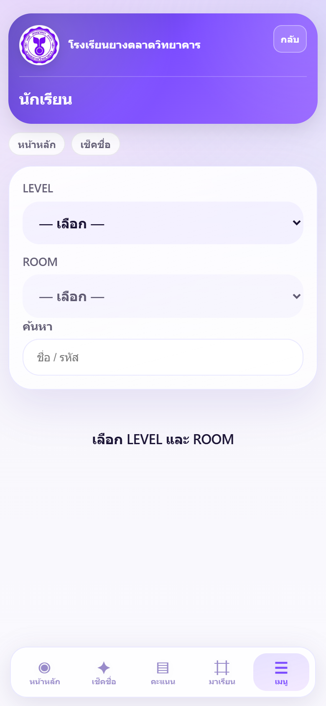

# คู่มือการใช้งานสำหรับครู

> งาน Admin / ตั้งค่าระบบ → **ADMIN_MANUAL.pdf**

## 0. ภาพรวมระบบ

### วัตถุประสงค์ของระบบ (System Objectives)

Student Check จัดทำเพื่อให้ครูและโรงเรียนสามารถ:

- บันทึกการมาเรียนประจำวันได้รวดเร็ว แม่นยำ และตรวจสอบย้อนหลังได้
- สรุปสถิติการมาเรียนและส่งออกรายงาน PDF สำหรับงานวิชาการ
- ลดงานกระดาษและลดความผิดพลาดจากการเช็คชื่อแบบเดิม
- ใช้งานผ่านมือถือหรือคอมพิวเตอร์ (PWA) โดยไม่ต้องติดตั้งจาก Store

### ขอบเขตระบบ (System Scope)

| อยู่ในขอบเขต | อยู่นอกขอบเขต |
|--------------|---------------|
| เช็คชื่อรายวัน · แก้ไขย้อนหลัง · รายงานมาเรียน · PDF | แก้รายชื่อนักเรียน/ครูในแอป (ทำที่ Google Sheets) |
| ดูประวัติ · Dashboard · ติดตั้ง PWA | ระบบลงทะเบียนนักเรียนใหม่แบบออนไลน์ |
| รายงานคะแนน (ครูที่มีสิทธิ์) | ส่ง SMS/LINE แจ้งผู้ปกครองอัตโนมัติ |

### บทบาทผู้ใช้งาน (User Roles)

| บทบาท | หน้าที่หลัก | เอกสารอ้างอิง |
|-------|------------|---------------|
| **ครูประจำชั้น** | เช็คชื่อห้องที่รับผิดชอบ · แก้ไขย้อนหลัง · ส่งออกรายงานห้อง | คู่มือฉบับนี้ |
| **ครูที่ปรึกษา / หัวหน้าระดับ** | ดูรายงานหลายห้อง · ติดตามนักเรียนเสี่ยง | คู่มือฉบับนี้ |
| **Admin / IT** | จัดการครู · นักเรียน · ตั้งค่าระบบ · Deploy | **ADMIN_MANUAL.pdf** |

:::workflow-user:::

:::infographic-system:::

## 1. เข้าสู่ระบบ (Login)

:::feature
| **วัตถุประสงค์** | เข้าใช้งานแอปด้วยตัวตนครู และตั้งค่าส่วนตัว (ภาษา · ธีม · PWA) |
| **ขั้นตอน** | 1. เปิด **https://student-check-th.web.app** · 2. กรอก **ชื่อครู** (หรือ USERNAME หากเปิด PIN) · 3. กด **เข้าสู่ระบบ** · 4. ออกจากระบบ: **เมนู** ☰ → **ตั้งค่า** → **ออกจากระบบ** |
| **หมายเหตุ** | ชื่อครูต้องตรงกับแท็บ TEACHERS · ครั้งแรกอาจติดตั้ง PWA จากหน้าตั้งค่า |
| **ข้อผิดพลาดที่พบบ่อย** | ไม่พบชื่อ → แจ้ง Admin · ไม่มีห้อง → Admin กำหนด `ASSIGNED_CLASSES` · ยังไม่เชื่อม Sheets → แจ้ง IT |
:::

:::row-figures

:::

:::figure-callout
**ภาพซ้าย:** ช่องกรอกชื่อครูและปุ่มเข้าสู่ระบบ · **ภาพขวา:** ตั้งค่าภาษา/ธีม · ติดตั้งแอบบนหน้าจอหลัก · ออกจากระบบ
:::

## 2. เช็คชื่อนักเรียน

:::feature
| **วัตถุประสงค์** | บันทึกสถานะมาเรียนประจำวันของห้องที่รับผิดชอบ |
| **ขั้นตอน** | 1. แถบล่าง → **เช็คชื่อ** · 2. เลือก **LEVEL / ROOM** · 3. กด **มาทุกคน** · 4. แก้เฉพาะคน **สาย / ขาด / ลา** · 5. กด **บันทึก** |
| **หมายเหตุ** | ทุกคนเริ่มต้นเป็น **“ขาด”** · วันเสาร์–อาทิตย์ดูอย่างเดียว บันทึกไม่ได้ · หลังบันทึกแล้วแก้ได้ที่ **ประวัติ** |
| **ข้อผิดพลาดที่พบบ่อย** | ลืมกด **มาทุกคน** → ทุกคนเป็นขาด · ลืมกดบันทึก → ข้อมูลยังไม่เข้าระบบ · เช็คผิดห้อง → แจ้ง Admin ลบรายการ |
:::

:::warning
**⚠️ สำคัญ** — กด **มาทุกคน** ก่อนเสมอ แล้วค่อยแก้เฉพาะคนที่มาไม่ครบ
:::

:::figure-callout
**จุดสำคัญ:** ① เลือกห้อง · ② ปุ่ม **มาทุกคน** (ต้องกดก่อน) · ③ แตะชื่อเพื่อเปลี่ยนสถานะ · ④ **บันทึก** เมื่อครบ
:::

## 3. แก้ไขข้อมูลย้อนหลัง

:::feature
| **วัตถุประสงค์** | แก้สถานะเช็คชื่อวันอื่น หรือลบรายการที่บันทึกผิด |
| **ขั้นตอน** | 1. **เมนู** ☰ → **ประวัติ** · 2. ตั้ง **วันที่** และ **ห้อง** · 3. แก้สถานะหรือกด **ลบ** · 4. บันทึก |
| **หมายเหตุ** | แก้ชื่อ/ห้องนักเรียนใน Sheet → แจ้ง Admin · Admin แก้ได้ทุกห้อง |
| **ข้อผิดพลาดที่พบบ่อย** | ไม่เห็นข้อมูล → ตรวจวันที่/ห้อง · ครูทั่วไปแก้ได้เฉพาะห้องที่รับผิดชอบ |
:::

:::figure-callout
**จุดสำคัญ:** เลือกวันที่และห้องก่อน · แตะรายการเพื่อแก้สถานะ · ใช้ **ลบ** เมื่อเช็คผิดห้องทั้งหมด
:::

## 4. รายงานมาเรียน

:::feature
| **วัตถุประสงค์** | ดูสถิติการมาเรียนและส่งออก PDF สำหรับงานวิชาการ |
| **ขั้นตอน** | 1. แถบล่าง → **มาเรียน** · 2. เลือกโหมด (รายวัน / รายเดือน / ภาคเรียน*) · 3. ตั้งตัวกรอง (วันที่ · ห้อง) · 4. **ส่งออก PDF** |
| **หมายเหตุ** | รายงานรายเดือน — เลือกห้องก่อนส่งออก PDF · *ภาคเรียน — Admin เท่านั้น · ช่วงยาวเกิน 35 วัน (ไม่เลือกห้อง) — จำกัด |
| **ข้อผิดพลาดที่พบบ่อย** | PDF ว่าง → ตรวจว่ามีการเช็คชื่อในช่วงนั้น · เปิด PDF ไม่ได้ → ใช้ Adobe Reader หรือ Edge |
:::

:::row-figures

:::

:::figure-callout
**ภาพซ้าย:** แท็บโหมดรายงานและตัวกรอง · **ภาพขวา:** รายงานรายเดือน — ต้องเลือก LEVEL+ROOM ก่อนกดส่งออก PDF
:::

## 5. คำถามที่พบบ่อย (FAQ)

| คำถาม | คำตอบ |
|-------|--------|
| Q1 ลืมกดบันทึก | ยังไม่บันทึก = ยังไม่เข้าระบบ · ผิดแล้ว → **ประวัติ** |
| Q2 ลืมเช็คชื่อวันนั้น | เช็คชื่อ = วันนี้ · วันอื่น → Admin แก้ **ประวัติ** |
| Q3 เช็คผิดห้อง | Admin ลบรายการผิด · เช็คห้องใหม่ |
| Q4 ทุกคน “ขาด”? | กด **มาทุกคน** ก่อน |
| Q5 ไม่เห็นห้อง | ตรวจ `ASSIGNED_CLASSES` · ติดต่อ Admin |
| Q6 ไม่มีชื่อนักเรียน | Admin เพิ่ม **Students** · รีเฟรช |
| Q7 นักเรียนย้ายเข้า | Admin เพิ่ม Sheet → รีเฟรช |
| Q8 เปลี่ยนครูที่ปรึกษา | Admin แก้ TEACHERS |
| Q9 รายงาน/PDF ว่าง | ตรวจวันที่ · ห้อง · มีการเช็คชื่อ |
| Q10 PDF เปิดไม่ได้ | Adobe Reader / Edge |
| Q11 ออฟไลน์ | มีเน็ตแล้วกด **ซิงค์เลย** |
| Q12 ป้าย “เสี่ยง” | ขาด/สาย/ลาเกินเกณฑ์ภาคเรียน |
| Q13 ภาษา/ธีม | **เมนู** → **ตั้งค่า** |
| Q14 ติดตั้ง PWA | **เมนู** → **ตั้งค่า** → **ติดตั้งแอป** |
| Q15 แก้รายชื่อในแอป | ไม่ได้ — Admin แก้ Sheet |
| Q16 คำถาม Admin | **ADMIN_MANUAL.pdf** |

## ภาคผนวก

### แถบเมนูล่าง

| ไอคอน | ชื่อ | หน้าที่ |
|-------|------|--------|
| ◉ | หน้าหลัก | สรุปวันนี้ · เมนูด่วน |
| ✦ | เช็คชื่อ | บันทึกวันนี้ |
| ▤ | คะแนน | รายงานคะแนน (ครูที่มีสิทธิ์) |
| ⌗ | มาเรียน | รายงาน · PDF |
| ☰ | เมนู | ประวัติ · นักเรียน · ตั้งค่า |

:::row-figures

:::

:::figure-callout
**ภาพซ้าย:** หน้าหลักแสดงสรุปวันนี้ · **ภาพขวา:** รายชื่อนักเรียนในห้อง — ค้นหาและดูโปรไฟล์
:::

### ติดต่อและ Version History

| เรื่อง | รายละเอียด |
|--------|------------|
| ใช้งานแอป | Admin โรงเรียน · IT |
| ตั้งค่าระบบ | **ADMIN_MANUAL.pdf** |

| เวอร์ชัน | วันที่ | สรุปการเปลี่ยนแปลง |
|----------|--------|---------------------|
| **1.x** | 18 พ.ค. 2569 | **เปิดใช้งานครั้งแรก** — เช็คชื่อ · Dashboard · Login ชื่อครู (ยังไม่มี PIN) |
| **2.x** | 25 พ.ค. 2569 | เพิ่มรายงานมาเรียน |
| **3.0.0** | 28 พ.ค. 2569 | PWA · Firestore · PIN · โครงสร้างระบบใหม่ |
| **3.0.1** | 7 มิ.ย. 2569 | รายงานคะแนน · ตรวจระเบียบ · แถบเมนูล่าง |
| **3.1.0** | 20 มิ.ย. 2569 | Quick Start · รายงาน PDF · layout มือถือ · คู่มือส่งมอบ |

*Student Check v3.1.0 · SC-UM-001*
